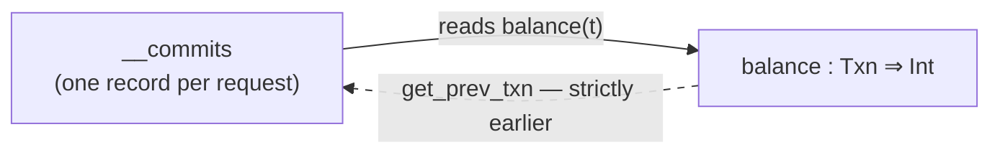

# Mutability end to end

A walkthrough of how `:=`, `for`-loop accumulation, `with begin():` transactions, and
`<<` feeds become pure dataflow. Written for people who work on Cambra but have not
worked *inside* the mutability machinery.

This is a tour, not a specification. The two documents it is a tour *of* are:

- [chl-spec.md](chl-spec.md#8-mutability-transactions-and-feeds) — the observable
  contract: what a programmer writes and what they may rely on.
- [mutability.md](../src/ccl/design/mutability.md) — the realization: every mechanism,
  in full.

Everything here is checkable. Every CCL listing below is **real compiler output**,
re-wrapped for reading — the compiler dumps its intermediate form after each stage under
`RUST_LOG=debug`. Put either §7 program in a file and watch it go through:

```bash
cargo build && RUST_LOG=debug ./target/debug/cambra prog.chl
```

Each stage prints under its own name (`Lowered`, `Inferred`, `Letrec phase CCL`,
`Join-planned CCL`, …), which is where the listings in §7 come from.

**The eight sections in one line each.** §1–3 are the model and the one asymmetry that
explains the rest; §4 is the surface language; §5 is `Mut` as a type; §6 is the pipeline;
§7 follows two programs all the way down; §8 is the runtime. §1–4 stand alone if you only
want the concepts.

For what is *not* built yet, the design doc's
[not-yet-implemented list](../src/ccl/design/mutability.md#not-yet-implemented) is
authoritative — this tour describes what exists.

---

## 1. The problem

CHL programs reassign variables, accumulate across iterations, run transactions, and
stream replies to sinks. The runtime is a pure dataflow graph over tilings, and there is
no mutable cell anywhere in it.

Both halves are fixed. Programmers want the Pythonic surface; the substrate wants values
that can be tiled, incrementalized, and distributed.

```
    CHL (surface-impure)                       CCL / runtime (pure)
  ┌────────────────────────┐               ┌────────────────────────┐
  │  cnt := 0              │               │  letrec over a causal  │
  │  for x in xs:          │  ──eliminate──▶  recursion; tiles;     │
  │      cnt += x          │               │  no cell, no update    │
  │  out << cnt            │               │                        │
  └────────────────────────┘               └────────────────────────┘
```

**Why not just compile `:=` to a cell?** A cell has no tiling. It has no partial state
to `⊕`, nothing for a watermark to describe, no way to be incremental or distributed.
Whatever mutation compiles to has to be an ordinary value in the algebra — which means
the *whole history* of the variable, not its latest snapshot.

## 2. The model

### A mutable variable is a function

> A mutable variable **is** a function from a **sequencing domain** (a time axis) to a
> value. "Mutation" is the incremental revelation of that function's values as the
> domain advances; "reading the variable" is looking up a value at a position.

```
  cnt := 0
  for i in [1, 2, 3]:          cnt : [0, 2] ⇒ Int
      cnt += i
                         position:   0     1     2
                            value:   1     3     6
                                     ▲
                                  a read here is a lookup, not a load
```

Nothing is ever overwritten. The variable's *whole history* is a value in the algebra,
and the program's reads are lookups into it.

### This is extent and tiling, applied to time

The correspondence is the one the substrate already runs on
([operational-semantics/summary.md](operational-semantics/summary.md)), pointed at a time
domain:

| | extent (the final thing) | tiling (the progress algebra) |
|---|---|---|
| a value type | its set of final values | its partial states, joined by `⊕` |
| a mutable variable | the total functions `𝐷 ⇒ 𝑉` | the accumulating partial `𝐷 ⇀ 𝑉` |

Each mutation is a `⊕`-extension by one position. The tiling *implements* the function; it
does not redefine it. This is the sentence that makes everything after it ordinary:
mutability is not a new mechanism bolted onto the substrate, it is the existing one applied
to a new domain. §8 shows the one place that claim is cashed in — the changelog tiling, whose
*extent* is an ordinary function's and whose progress algebra is not.

### Two merge laws, one object

A feed (`o << e`) is the **same object** — a function over the same kind of domain — and
therefore the **second form of mutability**, not a separate concept. `o << e` is
surface-impure in exactly the way `x := e` is: action at a distance on something bound
elsewhere.

The two differ only in their merge/read law:

```
  overwrite  (:=)                        append  (<<)
  last-write-wins, carry-forward         contributions union (++), no carry-forward

  pos:  0    1    2    3                 pos:  0    1    2    3
  wr:   5    ·    9    ·                 wr:   a    b    ·    c
  val:  5    5    9    9                 val: {a}  {b}  {}   {c}
        └────┴─── carried ───┘
  a read derefs to one scalar            a read yields the whole stream
```

One type carries both: `Type::History { value, domain, kind }`, where `kind` is
`Overwrite` (displayed `Mut(𝑉, 𝐷)`) or `Append` (displayed `feed(𝐷 ⇒ 𝑉)`). This
distinction is the through-line of the whole design — it is why the eliminator has two
halves, and why the two get different aliasing rules (see
[§5](#5-mutability-is-a-type)).

### Three domains, one model

A mutable variable's domain is the domain of the context that **writes** it:

| Mutation context | Sequencing domain | Causal accessor |
|---|---|---|
| sequential statements | degenerate (each position used once) | plain `let` shadowing — no letrec |
| `for` loop | the iteration source's domain | `get_prev_seq` |
| `with begin():` | `Txn` — a total order issued by the runtime | `get_prev_txn` |

**One model, three domains — not three mechanisms.** Sequential rebinding, loop
accumulation, and concurrent transactions differ only in which row of that table they
land on. `x := 0` at the top level followed by a loop that writes it is an *induction*
mutable variable over that loop's domain, not a degenerate one — Example A below shows it
acquiring `[0, 2]`. The degenerate row is what a mutable variable gets when nothing but the
statement sequence writes it, and it needs no letrec at all.

**`Txn` is the exception to inference.** It is never inferred, always spelled at the
introduction (`balance: Mut(Int, Txn) := 0`), because sharing state across concurrent
writers is a semantic commitment the program has to make rather than acquire.

**The introduction site fixes placement, not the domain.** What it constrains is that the
mutable variable must be introduced *outside* the context that sequences it. A `:=` inside a
`for` body or inside a `with begin():` block is rejected: its domain would have to nest
inside the enclosing one — a fresh iteration extent per iteration, or a fresh commit order
per transaction — and neither the recurrence nor the commit model has a carrier for that.
So a transactional mutable variable is introduced at the top level and *written* inside blocks,
which is the shape of every example in this document.

### Causality is what makes it well-founded

Every history becomes a binding in one mutually-recursive group — a `LetRec`. The group
has a unique solution because every recursive reference is **causal**: it consults only
*strictly earlier* positions, through one of two builtins.

| Builtin | Type | Meaning |
|---|---|---|
| `get_prev_seq` | `(𝐼 ⇒ 𝑉, 𝐼, 𝑉) ⇒ 𝑉` | the history at the predecessor of a position; the default at the first |
| `get_prev_txn` | `(𝐼 ⇒ {time: Txn, write: 𝑉}, Txn, 𝑉) ⇒ 𝑉` | the write of the latest commit strictly *before* a time; the default if none |

Every cycle in the reference graph must cross one of these. That is the whole
well-foundedness argument: go around any cycle and the position strictly decreases, so
induction along the domain order gives a unique solution.



The dashed edge is the causal one. A structural check enforces this at two walls (once
on the term tree, once on the point-free form after `lambda_elim`); an unrecognized
non-causal cycle is a **compile error**, never a fixpoint iteration.

## 3. Induction vs. transaction: the asymmetry that explains everything downstream

The two overwrite domains look symmetric in the model and are not, for one reason:

**An induction variable's domain *is* its writer's domain.** One loop, one writer, so
its history is directly the recurrence:

```
cnt : IncrIdx ⇒ Int  =  λ 𝑟 → get_prev_seq(cnt, 𝑟, 0) + 1
```

**A transactional variable's domain is *nobody's* writer domain.** Writers iterate
request streams; an oracle assigns each transaction its position in the commit order. So
the history cannot be written directly — it is defined **indirectly**, through commit
records:

```
  writer site (one per `with begin():`)          the mutable variable's history
  ┌──────────────────────────────────┐           ┌──────────────────────────────┐
  │ per iteration 𝑟:                 │           │ balance : Txn ⇒ Int          │
  │   t = begin_incr(𝑟)   ← oracle   │  ──────▶  │  λ 𝑡 → get_prev_txn(         │
  │   {time: t, write: balance(t)+1} │           │      commits, 𝑡, 0)          │
  └──────────────────────────────────┘           └──────────────────────────────┘
      a stream over the *request* domain             a function of *commit time*
```

Three consequences fall straight out of this shape, and they are worth naming because
they are the answers to the three questions people usually ask:

- **Atomicity is representational.** A multi-variable block produces *one* record
  `{time, writes: {𝑘₁: 𝑉₁, …}}`, and each variable reads it through a per-key view. A
  partially-visible commit is not prevented — it is **unrepresentable**, because no term
  denotes one.
- **Multiple writers are fine.** Several sites writing one mutable variable merge their commit
  streams by time before the search. Nothing is single-writer here.
- **A denial writes nothing at all.** Commit records exist only for committed
  transactions (allocate-on-commit), so `get_prev_txn` searches with no `commit: Bool`
  filter to apply.

## 4. What a programmer writes

```python
cnt := 0                       # induction accumulator; domain inferred from its loop
balance: Mut(Int, Txn) := 0    # transactional mutable variable over the commit order

for req in reqs:
    with begin():
        balance += req
    resps << balance_ok(cnt)
```

- **`:=` introduces *and* writes** — the annotation does not. `Mut(𝑉)` is optional;
  `+=`/`-=`/… are compound forms of the same operator.
- **`Txn` is never inferred.** Sharing state across concurrent writers is a semantic
  commitment, so a transactional mutable variable is always spelled `Mut(𝑉, Txn)`.
- **A `:=`/`+=` to a name that is not mutable is a type error**, not a silent rebind.
  This is the one rule that makes "declare it with `:=`" a real discipline.
- **`Mut(𝑉)` is legal as a parameter annotation** — pass-by-reference, so a callee writes
  the caller's variable.

### The read rules

| Where | What a bare mention means |
|---|---|
| inside the writing loop/block | the value at the current position — the previous iteration's, or the just-written one (**read-your-writes**) |
| after a `for` loop | the accumulator's **final** value (the loop has ended, so "latest" is unambiguous) |
| inside a `with begin():` | a **snapshot-consistent** view — several reads in one block see one snapshot. This is why the block is required |
| fed out of a read-only block | an **as-of read at an arbitrary commit position** — the variable as of wherever the reading transaction lands |
| `await_final(x)` | the one **terminal** mutable variable read: the value once every writer that can write `x` has drained. It **consumes** `x` — no later read or write may name it, which is what closes the writer set and makes "final" a fixed value |

> **Transactional mutability is unordered by design.** There is no ordering guarantee
> between transactions beyond the existence of *a* commit order the runtime picks. A
> trailing read that samples an early position is the model working, not a bug. If a
> program needs a definite value it must ask for one, and `await_final` is the only way
> to ask — which is the point of separating the two reads rather than guessing which a
> bare mention meant.

### Where a `<<` sits decides what it means

A reply's placement relative to `with begin():` decides three things at once: **when it
fires**, **what it is indexed by**, and **what it is allowed to read**. There are three
placements, and they are not freely interchangeable — moving a `<<` between them is often
a compile error rather than a change of behaviour.

**1. Inside the writing block — commit-ordered and commit-gated.** The `<<` rides the
writer's decision as a tap, committed atomically with the write. So it is sequenced
*after* the commit, indexed by commit tick, and **gated**: a denied transaction replies
nothing.

```python
out = defer()
pool: Mut(Int, Txn) := 100
for r in [70, 50]:
    with begin():
        if pool >= r:
            pool := pool - r
            out << pool
out
```

`r = 70` commits (`pool` 100 → 30) and replies `30` at commit tick 1. `r = 50` fails its
guard `30 >= 50`, so that transaction denies: no tick, no write, **no reply**. `out` holds
one element, not two.

**2. Outside any block, on the loop spine — iteration-indexed and ungated.** It fires
every iteration regardless of what the transaction decided, riding the loop's own domain:

```python
resps = defer()
store: Mut(Int, Txn) := 0
cnt: Mut(Int) := 0
for r in [10, 20, 30]:
    with begin():
        store := store + r
    cnt := cnt + 1
    resps << cnt
resps
```

`resps` is `[1, 2, 3]` — the induction counter, request-indexed, unrelated to the commit
clock. Note *what* it replies: `cnt`, not `store`. It could not reply `store`, because a
`Txn` mutable variable may only be read inside a block — which is what makes placement 3 exist.

**3. Inside a read-only block — an as-of sample.** A block that reads a variable it does
not write is not a writer at all: it mints no commit-time oracle, produces no record, and
takes no commit slot. It compiles to `AsOf` — the variable as of wherever this read lands
in the commit order, indexed by the *reading* loop. The cross-endpoint read in the design
doc's worked example is this shape; §7's Example B deliberately is not, because its
standalone block *writes*, which makes it a second writer rather than a reader.

```python
with begin():
    out << pool
```

| Placement | Fires | Indexed by | May read the mutable variable |
|---|---|---|---|
| inside the writing block | only on commit | commit tick | yes — the block's snapshot, read-your-writes |
| outside any block | every iteration | the loop's domain | **no** — a bare `Txn` read there is rejected |
| inside a read-only block | every trigger position | the reading loop | yes — as an as-of sample |

So the rule of thumb is directional: **to gate or commit-order a reply, put it in the
block that writes.** What you get outside is value-correct and request-indexed, and what
you get in a read-only block is a sample, never a promise about the final value.

## 5. Mutability is a type

`Type::History { value: 𝑉, domain: 𝐷, kind: Overwrite | Append }`, displayed `Mut(𝑉, 𝐷)` for Overwrite and `Feed(D, V)` for Append

### Where the two slots come from

**𝑉 is a join over contributions.** A mutable variable is not one value — it is the
sequence its seed and its writes produce — so its value type is the *join* over all of
them, and the lattice already **is** that join: every contribution is a **lower bound** on the
mutable variable's value variable.  Each write to the variable (for mut and feed) contributes the type of
the rhs to this join.

A read is a positive position, so it *intersects* refinement sets: a refinement survives
exactly when **every** contribution establishes it. Nothing pre-emptively weakens a
contribution to arrange this — the lattice does it. Two real programs, one line apart:

```python
r = (a=7, b=9)        #  x : Mut(Int@7, ?26)
x := r.a              #  one contribution, so the seed's singleton survives — correctly,
x                     #  since the mutable variable really does hold 7 at every position
```

```python
r = (a=0, b=9)        #  x : Mut(Int, ?33)
x := r.a              #  the write contributes a plain Int, and the intersection
for i in [1, 2, 3]:   #  drops the singleton
    x += i
x
```


**𝐷 is not inference's to solve.** For an induction variable it stays an unresolved
variable through the whole of inference — the `?26` / `?33` above — and `mut_elim` fills
it in later from the writing loop's source domain. `Txn` is the exception: never
inferred, so it arrives from the annotation and is a `Txn` from the start.
For a feed, `channelize` computes the union of all domains that feed into it.

### Subtyping

**`Mut(V, D)` is fully invariant.** It does not relate to either bare value types or other Mut types.

**`Feed(D, V) <: D ⤇ V`** Deferred collections can be used like any other collection.

The kind slot admits no relation at all: an `Overwrite` and an `Append` history are
different types.

`Mut` has several other additional interactions with lowering and the type system.  `Mut` types
are second-class, and can only be top-level types in variable declarations and function parameters.
Whenever a `Mut`-typed variable is read, the compiler inserts a deref operation that reads the value
out of the variable.  This means that `b := a` initializes `b` to the value of `a` at that point.

## 6. The pipeline

```
CHL source
  → parse
  → lower              surface CCL: MutDecl / MutWrite / For / Begin / Feed / Defer.
                       No mutability classification — scope only.
  → uniquify
  → infer + check      Mut / Feed / Txn are ordinary types here
  → inline             UDFs reach their call sites — writers included
  → transact_phase     three rejection gates, then TRANSACTIONAL elimination → Txn LetRec
  → mut_elim           INDUCTION elimination → causal LetRec
  → channelize         APPEND elimination → the letrec's output channels
  → live-read rewrite  fed-out mutable variable reads → AsOf
  → lambda_elim        the LetRec travels through; bodies become point-free
  → plan_loops         point-free letrec patterns → the `Transact` carrier
  → planning           the rest of `planning` — joins, group-by, and the iteration
                       staging that wraps every source as `iterate ≫ …`. Nothing
                       mut-specific
  → operator_conversion  Transact → engines, dispatched on the domain
```

**Mutability elimination has two halves, one per merge law.** Overwrite mutability becomes
the causal `LetRec` — `transact_phase` taking the `Txn` domain and `mut_elim` the induction
domain, in that order, so the induction slice never meets a transaction loop; `channelize`
then discharges append mutability into that letrec's **outputs** (a feed can be an output
rather than a cyclic binding precisely because it has no carry-forward). Together they are
the surface-CCL → pure-CCL step: the mutability analog of `lambda_elim`.

Inlining runs **before** all of them so that a UDF writing a `Mut` parameter is
beta-reduced to its call site, where its writes land in the scope of the variable they
target. Pass-by-reference needs no machinery of its own — it is substitution.

Lifespans are more useful than a stage list:

```
                      lower  infer  inline  transact  mut_elim  channelize  λ_elim  plan_loops  op_conv
  Begin                 ●━━━━━━━━━━━━━━━━━━━━━━━●
  For/MutWrite/MutDecl  ●━━━━━━━━━━━━━━━━━━━━━━━━━━━━━━━━━●
  Mut type              ●━━━━━━━━━━━━━━━━━━━━━━━━━━━━━━━━━●
  Feed/Defer            ●━━━━━━━━━━━━━━━━━━━━━━━━━━━━━━━━━━━━━━━━━━━━●
  Feed type             ●━━━━━━━━━━━━━━━━━━━━━━━━━━━━━━━━━━━━━━━━━━━━●
  LetRec                                        ●━━━━━━━━━━━━━━━━━━━━━━━━━━━━━━━━━━━━━━━━●
  Transact                                                                               ●━━━━━━━━━●
```

`Begin` dies earliest — `transact_phase` consumes every block before the induction slice
runs. The `Mut` type erasure is split the same way: a `Txn` mutable variable's wrapper goes
with `transact_phase`, an induction one's with `mut_elim`, and each phase asserts its own
half is gone.

No mutability marker and no history type survives `channelize`. Just before lambda_elim we
have the ordinary value algebra plus a general recursion node. `LetRec` is
deliberately more general than mutability needs, and is the same node `while` loops and
recursively-defined collections will target.

## 7. Through the pipeline, twice

Two programs, walked phase by phase. They are chosen because between them they exercise
**every** phase: **Example A** has an induction accumulator and no transaction, **Example
B** has a transactional mutable variable and a feed. So each phase below gets whichever
program actually gives it work to do, and the other is simply unchanged by it.

```python
# Example A — an induction accumulator  # Example B — a transactional variable
x := 0                                  out = defer()
for i in [1, 2, 3]:                     pool: Mut(Int, Txn) := 100
    x += i                              for r in [10, 20, 30]:
x                                           with begin():
                                                pool := pool - r
                                                out << pool
                                        with begin():
                                            pool := pool - 5
                                            out << pool
                                        await_final(pool)
```

**Example B** is deliberately the awkward shape rather than the tidy one: *two* writer sites
on one variable — a loop and a standalone block — each replying next to its write, and a
terminal read at the end. That is what makes the multi-writer merge §3 promised, the
commit-gated reply placement of §4, and `await_final` all visible in one program.

It answers **35**, and `out` collects `[95, 85, 65, 35]`. Read those numbers carefully:
`100 − 5` comes *first*. The standalone block's transaction committed before any of the
loop's, which is not a bug and not a scheduling accident to design around — it is §4's
callout in the concrete. Nothing orders the two sites relative to each other; only the
commit order the runtime picked, and every write lands exactly once, so the final value is
the same under any of them.

### `lower` — surface markers, no classification

Statements become marker nodes in 1:1 correspondence, and nothing is decided about
mutability. **Example A** — the domain is a hole:

```
x : Mut(_, _) := 0
in for i in [1, 2, 3] do x := x + i; unit;
x
```

**Example B** — note the last block. A standalone transaction lowers as a *singleton loop*
wrapping a `Begin`, so there is only ever one shape downstream and no special case for
"a block not in a loop":

```
let out = defer
in pool : Mut(Int, Txn) := 100
in for r in [10, 20, 30] do begin { pool := pool - r; unit }; unit;
   for __txn_item_0 in [unit] do begin { feed(out, pool); unit }; unit;
out
```

### `infer` — `Mut` is an ordinary type here

**Example A**, with the value type solved and the domain still open (`?29`). The
occurrences are the point: the write target and the trailing mention carry `Mut`, and
`x + i`'s operand is what §5's read rule derefs:

```
x : Mut(Int, ?29) := 0
in for i in [1, 2, 3] do x := x + i; unit; x
```

### `transact_phase` — the transactional slice

Runs **first**, so the induction slice never meets a transaction loop. Three gates ahead of
it only *reject* — nested transactions, a block writing no transactional variable, a guarded
induction write inside a block — so nothing downstream has to represent those shapes.
`collect_txn_registers` then yields α-unique names that everything after keys on, rather
than on syntax. Four steps:

1. **strip** — consume every `Begin`, building one writer site per writing block: its
   read/write footprint, its loop source, and a `` `commit ``/`` `abort `` decision lambda
   built by read-your-writes substitution. An in-block `<<` becomes a `to_<defer>` tap on
   the `` `commit `` payload. A *read-only* block leaves no writer site, but its footprint
   is kept — it is a reason two variables share a store.
2. **partition** — union-find over those footprints, so a program gets one store per set of
   variables some block actually relates, rather than one store overall. A block is the only
   thing that forces two variables together, and for two reasons that land on the same set:
   a writing block commits its keys at one tick, and a read-only block latches its reads at
   one frontier. A store may not depend on its own `await_final`, checked here because the
   rule is store-relative: an await of a key in a *different* store is an ordinary edge
   between two recurrences.
3. **assemble** — one history binding per key (`λ 𝑡 → get_prev_txn(view, 𝑡, init)`), one
   commit-record binding per site over that site's loop domain, its decision evaluated at
   `begin_<site>(𝑟)`.
4. **rebind** — each key's `let x = init` becomes `let x = as_of_read(hist_x)`, the read whose
   sampling position `rewrite_as_of_reads` supplies later; hoisted feeds become ordinary
   `Feed(defer, tap)`. A key read *only* by an await has no reference left to bind and is
   skipped.

Awaits resolve across the same phase: `await_final(x)` becomes `final_read(hist_x)`. A key **no
writer site writes** never gets that far — its write history is statically empty, so the await
becomes its seed. That covers a variable no block mentions and one some block only reads, which is
a key of the store all the same.

**Example B** after it. Both writing loops are hollowed out to `do unit` — their bodies
lifted into the letrec below — which is the clearest single picture of what this phase does:

```
let out : feed(chan(out) ⇒ Int) = defer
in for r in [10, 20, 30] do unit;
   for __txn_item_0 in [unit] do unit;
   letrec
     pool : (Txn ⇒ Int) =
       λ __t : Txn →
         ( (time: …, write: …) ▷ zip ⊎ (time: …, write: …) ▷ zip,   ← both sites, merged
           __t, 100 ) ▷ get_prev_txn

     __commits : ([0, 2] ⇒ {…, decision: {`commit{writes: (Int), to_out_0: Int} | `abort}}) =
       λ __r : [0, 2] → … `commit((writes: (__txp.0 - __txp.1), to_out_0: __txp.0 - __txp.1)) …

     __commits : ([0, 0] ⇒ {…, decision: {`commit{writes: (Int), to_out_1: Int} | `abort}}) =
       λ __r : [0, 0] → … `commit((writes: (__txp.0 - 5), to_out_1: __txp.0 - 5)) …

     to_out_0 : ([0, 2] ⇒ Int) = __commits ≫ .decision ≫ variant_project(`commit) ≫ .to_out_0
     to_out_1 : ([0, 0] ⇒ Int) = __commits ≫ .decision ≫ variant_project(`commit) ≫ .to_out_1
   in feed(out, to_out_0); feed(out, to_out_1); pool ▷ final_read
```

Reading it off — exactly the shape §3 predicted, now with two writers:

- **one `__commits` per site**, each over its *own* request domain (`[0, 2]` for the loop,
  `[0, 0]` for the standalone block). `__r ▷ begin` is that site's commit-time oracle.
- **`pool` merges both**: `(…) ▷ zip ⊎ (…) ▷ zip`, the union of the two sites' commit
  streams, searched by time. This is §3's "several sites writing one variable merge their
  commit streams before the search" — nothing here is single-writer.
- **`pool(__t)`** inside each record is the snapshot read; through `pool`'s own definition it
  resolves to the latest commit *strictly before* `__t`, so it is not a self-reference at the
  same position. The `pool ↔ __commits` cycle crosses `get_prev_txn` exactly once, so it is
  well-founded.
- **each `<<` became a tap on its own site's decision** — `to_out_0` beside `writes` in the
  loop's `` `commit `` payload, `to_out_1` in the block's. A denied transaction carries
  neither, which is placement 1 of §4 in the concrete: a reply is gated on the commit because
  it *rides* the commit.
- **the trailing read is `final_read`**, which is what `await_final` resolves to: a sample of
  `pool`'s carried value at the position its own writers finish. It takes no seed operand,
  tick 0 of the store being the seed.

*Why that second gate earns its keep:* an out-of-block write that slipped the lowering gate
would otherwise become a shadowing `let` that quietly discards committed values.

### `mut_elim` — the induction slice

`flatten_spine` → `rewrite` → `erase_mut` → assert.

The first step is the one to know about: inlining a pass-by-reference writer splices its
body at the call site and can bury a `MutWrite` off the statement spine, where the main walk
reads it as a pure value and drops the update. Commuting conversions lift those back. The
asserts fire in **release**, not debug, because a leaked marker is a miscompile and
`lambda_elim`'s catch-all would pass one through silently.

**Example A** after it — the markers are gone and a causal `LetRec` has replaced them:

```
let x : Int = 0
in letrec
     __hist : ([0, 2] ⇒ {`commit{writes: (Int)} | `abort}) =
       λ __pos : [0, 2] →
         let __prev : (Int) = (__hist ≫ variant_project(`commit) ≫ .writes, __pos, (x))
                              ▷ get_prev_seq
         in (__prev.0, __pos ▷ [1, 2, 3])
            ▷ (λ __p : (Int, Int) → { true → `commit((writes: (__p.0 + __p.1)));
                                      true → `abort(unit) })
   in let x : Int = (__hist ≫ variant_project(`commit) ≫ .writes ≫ .0, x)
                    ▷ final_or_default
   in x
```

Four things to read off it:

- The recurrence is exactly the model's `λ 𝑟 → get_prev_seq(cnt, 𝑟, 0) + 1`, with the seed
  `x` as `get_prev_seq`'s default — that is where the initializer goes.
- The loop source is applied at the position: `__pos ▷ [1, 2, 3]` *is* `i`. A collection is
  a function, so "the element at this iteration" is a lookup.
- **The writer body is a decision**, `` `commit(writes) `` or `` `abort ``, even though this
  write is unconditional (both guards are `true`). That is not induction-specific
  scaffolding — it is the *same* shape B's writer produced above, which is what lets one
  carrier and one set of planning patterns serve both domains. The tagged sum is what makes
  "no write" unable to carry a write set.
- The trailing `x` became `final_or_default(history, seed)` — well-defined because the loop
  ends.

### `channelize` — the append half

Each `let d = Defer in …` cluster becomes one mutually-scoped `LetRec` group, which buys two
things: cross-channel references (`x <<= y`) need no binding order, and a channel *cycle*
falls out as an error from the causality rule the mutable-variable groups already use — a
channel carries no guard, so a cycle has no well-founded solution.

The phase is **origin-agnostic**: `mut_elim` has already hoisted in-loop feeds to ordinary
feeds of the loop's history, so nothing here distinguishes an accumulator-loop feed from a
scalar one. Closing the tree is then a pure substitution — each rigid `ChanDom(d)` to its
channel's concrete domain, each `Feed` history to its stream `Fun` — possible only because
inference typed every consumer against the rigid name instead of leaving an `Infer`.

**Example B**'s tail after it. The two taps become one channel, and `out`'s domain is the
**union** of the two sites' request domains — one reply stream fed from two writers:

```
in letrec out : ([0, 2] | [0, 0] ⇒ Int) = to_out_0 ⊎ to_out_1
in pool ▷ final_read
```

That `|` is a `Union` domain — an anonymous positional sum, not a tagged variant — because a
reader of `out` has no use for which site produced an element.

### `rewrite_as_of_reads`, then `plan_loops` and the rest of planning

`rewrite_as_of_reads` is one rewrite, sitting between `channelize` and `lambda_elim` because
it needs the pointful shape: afterward the pattern it matches is gone. It turns a fed-out
read into `as_of`.

Planning then runs in two passes over the same tree, and the listings below are after
**both** — which is why each writer's source reads `iterate ≫ [1, 2, 3]`. `plan_loops`
recognises the carrier and leaves the source bare (`over [1, 2, 3]`); the general planning
pass that follows is what stages it. Only the first pass is mutability-specific.

`plan_loops` recurses into the continuation first (later loops and nested groups live
there), re-checks causality, and dispatches a group three ways:

- **no guard at all** → a channel cluster, flattened to dependency-ordered `let`s;
- **`get_prev_txn` + `begin_<site>`** → a transaction group;
- **otherwise** → a single-writer induction group.

`recover_writer` lifts each writer body **verbatim** — a `zip` is opaque to its shape parser
— which is the whole reason the elimination phases emit decision-factored bindings. They are
shaped for a consumer that refuses to rebuild a body.

**Example A**:

```
let x : Int = 0
in let __hist : {acc#8: ([0, 2] ⇒ Int)} =
     transact (acc = x) { [acc]⇒[acc] over iterate ≫ [1, 2, 3] do <the decision body, verbatim> }
in let x : Int = (__hist.acc#8, x) ▷ final_or_default
in x
```

**Example B** — one store, two writer clauses, and the taps as store keys beside the
variable's history:

```
let __hist : {pool#6: (Txn ⇒ Int), to_out_0: ([0, 2] ⇒ Int), to_out_1: ([0, 0] ⇒ Int)} =
  transact (pool = 100) { [pool]⇒[pool] over iterate ≫ [10, 20, 30] do <decision>;
                          [pool]⇒[pool] over iterate ≫ [unit]         do <decision> }
in let out : ([0, 2] | [0, 0] ⇒ Int) = __hist.to_out_0 ⊎ __hist.to_out_1
in __hist.pool#6 ▷ final_read
```

Both sites land in **one** `Transact` because they write the same variable — that is the
partition rule from `transact_phase`, and it is what makes their commits share a clock. A
reply tap rides as an ordinary store key (`to_out_0`, `to_out_1`) rather than as a second
mechanism.

`Transact` is the **only** recurrence carrier — every loop and every transaction becomes
one. Its header says what the keys are, what each writer reads and writes, and what it
iterates; the body is lifted verbatim from the letrec. B's last line is the store's **key
rebind**, the term `await_final` resolves to (§4) — and here it is the program's result
rather than a dead binding, which is what a key read *only* by an await looks like.

### `operator_conversion` — dispatch on the domain

The `Transact`'s domain picks the engine: a concrete iteration extent (**Example A**'s
`[0, 2]`) gives an `InductionStore`, `Txn` (**Example B**) gives the commit operator.

Reads then fall out of two independent choices. The **store kind** picks the operator, and a
per-key `carry_forward` flag picks what it means:

| Store | A key read is | carrying — a variable | non-carrying — a reply tap |
|---|---|---|---|
| induction changelog | `StoreDenseRead` over the loop extent | every position folds the latest write ≤ it | only the positions that fired |
| commit (`Txn`) | `StoreValueStream` over the commit log | a value at every tick | only the tick that wrote it |

Carrying is what makes a variable a variable: a tick that wrote some *other* key leaves this
one's value standing. A reply is an event instead, so it appears only where it fired — which
is why two writers' taps to one defer do not smear across the shared clock.

Two wrappers sit on top of that, and neither is mutability-specific:

- a **scalar** read of an accumulator — `x` after the loop — is `final_or_default(stream,
  seed)`, which compiles to `ExtractFinal`. `await_final(x)` is not this read: it is
  `final_read`, compiling to `StoreFinalRead`, which samples the key's carried value once the
  store reports it settled rather than reducing any stream;
- a **co-iterated** read consumes the stream directly, since it is already a `𝐷 ⇀ 𝑉`.

The exception is a `Txn` variable read *out of* a block: `rewrite_as_of_reads` turned that
into `as_of` back before `lambda_elim`, so it never reaches this dispatch. It becomes
`AsOf`, indexed by the **trigger** — the reading loop — rather than by the commit clock,
which is why a reply matches its reader by position and needs no correlation id. A
standalone read is the singleton-trigger case of the same operator, so there is no separate
compilation for it. No *ordinary* `Txn` read has a "final value" path: the only read that waits
for completeness is the explicit `await_final`, which is a different term (`final_read`) and a
different operator (`StoreFinalRead`).

No operator dump here, for a reason worth knowing when you go looking yourself: the graph
renderer roots at the program's **output** and stops at the first cyclic `FanOut` rather than
walking back into the store it wraps. What it prints for either program is the read side
above with a `→ FanOut#N` where the engine should be. §8 draws what is behind that edge.

### The mixed program

The design doc's [worked example](../src/ccl/design/mutability.md#worked-example) puts
both in one program across two HTTP endpoints — a `Mut(Int, Txn)` variable and an
induction counter written in the same block, replying on one endpoint and reading as-of
on the other. It is worth reading once you have these two, because it shows the one thing
neither shows alone: **the two domains are independent**. The counter advances per
request; only `Txn`-domain variables join the atomic commit. A program that wants the
counter transactionally consistent declares it `Mut(Int, Txn)`.

## 8. Engines

Induction and transactions dispatch to different operators, which makes it easy to assume
two implementations of a store. There is one. Both run the same `CommitEngine` over the same
`Tile::Store` changelog, consume the same `` `commit ``/`` `abort `` decision, and are read
the same way. `InductionStore` owns an engine too, seeded at tick 0 with the accumulator's
init. The design doc puts it exactly: an induction
store is "the degenerate no-conflict dual of the commit store".

What differs is only what *decides* a position:

| | `InductionStore` | commit operator |
|---|---|---|
| what decides a position | the next contiguous iteration position | a proposal that survives validation |
| ordering | strict predecessor dependence | any serialization the model admits |
| conflicts | impossible: single writer | validated read sets, skip and retry |
| what advances the cursor | the store's decided frontier, which is in the tile | the commit-ack, which is not — a commit is what *moves* the frontier |

That last row is the only one with real consequences downstream, and the rest of this
section is mostly about it.

### The changelog is a new *tiling*, not a new type

`Tile::Store` is the one thing mutability added to the substrate, and it is worth being
precise about what kind of addition it is. Its **extent** is an ordinary function's:
`Tiling::Store { domain, codomain }` and `Tiling::SealedFunction { domain, codomain }` both
report `Function { domain, codomain }`. A store is a `Txn ⇒ {key: value}`; there is no new
final value in the world.

What is new is the **progress algebra** — which is exactly the split §2's table draws:

| | `SealedFunction` | `Store` |
|---|---|---|
| a position present | its value is known | a write landed *at* that tick |
| a position absent | **unknown** — may still arrive | **decided-absent**: the value holds from the latest earlier change |
| how you read it | index the position | **fold** the changelog |
| how much exists | the domain predicate | `frontier` — `LessThanEq(w)`: the history is `w + 1` ticks long, trailing carries included |
| `⊕` | union the positions | append the changes, `max` the frontiers, `or` the terminal flags, union the closed keys |

### One shape, two engines

Both engines are the same cycle. A **store** consumes decisions and owns the engine; a
**driver** reads the store back and produces the body's input; the body sits between them, an
ordinary compiled operator graph.

Every box below is one operator and every arrow is a **tile flowing** from producer to
consumer. Nothing is pushed: each arrow moves when its consumer pulls, so data travels
against the direction of the `get` that causes it.

```
   source ──▶ driver ──▶ body ──▶ store ──▶ FanOut (cyclic) ──▶ readers
                ▲                                │
                └────────────────────────────────┘
                  the changelog, read back one position at a time
```

| | induction | transaction |
|---|---|---|
| store | `InductionStore` | `CommitOperator` + `TransactWriter` |
| driver | `InductionDriver` | `TransactDriver` |
| readers | `StoreDenseRead` → `ExtractFinal` | `AsOf`, `StoreValueStream`, `StoreFinalRead` |

**Why the driver is a separate operator.** The accumulator has to reach the body, and the
only sanctioned route is a tile pulled along an edge. Splitting the roles puts it on one:
the store's output *is* the changelog, and the driver folds each position's previous value
out of it. Nothing is handed sideways.

It also means the induction driver needs no state of its own. The store's decided frontier
*is* the next position to iterate — a carry decides its position without appending a change,
so the frontier tracks the whole extent — and the previous accumulator is that key's value
at the frontier. One `store_current` call answers both, so the driver's output is a pure
function of the store tile and the source tile.

**One position advances per outer pull.** The cyclic `FanOut` answers a re-entrant pull from
a snapshot taken before the traversal began, so a position decided *during* a pull is
invisible until the next one. That is a property of the cycle, not of the split: the store's
producer is on the stack for the whole traversal, so nothing can refresh the memo mid-pull.
It is the rate every cyclic operator here runs at, and the driver re-arms on the wakeup queue
while a position remains to feed.

It also makes the cycle well-founded. The driver emits the position the store says is next,
so the body is never asked for a position whose predecessor is undecided; each round either
advances the frontier or re-arms.

### What the transaction adds: the ack

An induction position is decided by the frontier. A transaction's is not — a commit is what
*moves* the frontier — so the driver cannot tell from the store alone whether its item
finished. The item cursor advances on the **commit-ack**, delivered as a release.

A release from the body alone would be wrong, and measurably so: a body releases a row the
moment it has *consumed* it, long before the attempt commits, which would advance the driver
past an item still in flight. So `TransactDriver` sits behind a `FanOut` with two branches —
the body and the writer — and advances on their **intersection**: consumed *and* finished.

The same cycle as before, with one extra edge — again with arrows as tiles flowing:

```
  source ──▶ TransactDriver ──▶ driver fan ──▶ body ──▶ TransactWriter ──▶ CommitOperator
                   ▲               │                         ▲                  │
                   │               └─────────────────────────┘                  │
                   │                   the ack branch                           ▼
                   └────────────────── store fan (cyclic) ◀────────────────────┘
```

The driver's tile reaches the writer twice: once through the body, which turns it into a
decision, and once directly. The second edge carries nothing the writer needs — it exists so
the writer has something to **release**, and that release is the ack. That is why the writer
holds an input it barely reads.

(One edge is left out to keep the picture readable: the writer also takes a store-fan branch
of its own, to read the frontier its proposal is built against.)

**Validate-then-allocate is what makes the concurrency safe.** A stale proposal never
consumes a tick, so the commit clock has no holes and a denied transaction leaves no trace —
the engine-level reason `get_prev_txn` needs no `commit: Bool` filter.

### Operators

| Operator | State it owns | What advances it | What it publishes |
|---|---|---|---|
| `InductionStore` / `CommitOperator` | a `CommitEngine`: `committed` (tick ⇀ write-set), `latest_write` (key ⇀ tick), `next_ts` | a decision consumed (`step`) / a proposal validated (`attempt`) | the changelog, with its frontier and terminal flag |
| `InductionDriver` | only its own emitted window | a pull, from the store tile and the source tile | the body's `(prev…, item)` input |
| `TransactDriver` | the item cursor, the emitted rows with their items, the `(item, frontier)` retry key | a pull, plus **release** — which is what advances the cursor | the body's `(snapshot…, item)` input |
| `TransactWriter` | the in-flight proposals, its decided watermark | a decision read, plus the commit-ack release | the proposal stream |
| `FanOut` (cyclic) | the memo of its input's last tile, per-branch release guards | a non-re-entrant pull refreshes the memo | its input's tile, per branch |
| `AsOf` | one latched value per trigger position | a trigger position first observed | `trigger ⇀ value` |

### The dispatch table

Sharing an engine does not make the two sides interchangeable — the commit store is built
for an open clock, the induction store for an ordered recurrence with no conflict to
validate. What the sharing buys is that everything beneath them is written once. What picks
between them is the letrec's shape:

| Letrec pattern | Engine |
|---|---|
| a binding read only via `get_prev_seq`, over an induction domain | `InductionStore` (+ `StoreDenseRead`) |
| commit records + `begin_<site>` oracles + histories read via `get_prev_txn` | the commit operator (+ `TransactWriter`) |
| a `Txn` history read out of a read-only block | `AsOf` |
| a non-causal cycle, or a causal shape planning does not know | **compile error** — no silent fallback |

## Recap

1. A mutable variable is a **function from a sequencing domain to a value** — extent and
   tiling, applied to time.
2. Overwrite and append are **two merge laws on one object**, which is why `<<` is the
   second form of mutability and why the eliminator has two halves.
3. Three domains — statement, induction, `Txn` — with **causal accessors** that make the
   recursion well-founded.
4. An induction variable's domain **is** its writer's; a transactional one's is not, so
   its history goes **through commit records** — from which atomicity, multi-writer
   merge, and denial all fall out.
5. Mutability is **a type**, and a read is **an explicit operation** at the rule that
   emits the operand — which is what makes the handle positions enumerable and lets
   invariance do its own job.
6. Everything meets one carrier (`Transact`) and is dispatched to an engine **by its
   domain** — two stores over one engine, each closing its recurrence through a cyclic
   fan so the accumulator crosses between operators as a tile like everything else.
