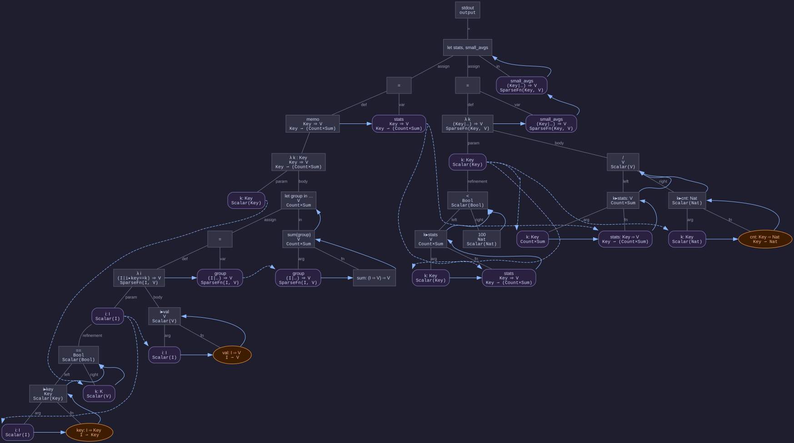

# Operational Semantics: End-to-End Example

See also:
- [semantics.md](semantics.md) — formal definitions of tilings (Section 1), guards (Section 2), and operators (Section 3)

---

## Example Program

```
// Assumptions:
I : Type
i-iter : Iterable I
Key : Type
key : I ⇒ Key
V : Type
v-sum : Summable V
val : I ⇒ V
cnt : Key ⇒ Nat
sum : {I, S : Type,
      iter : Iterable I,
      plus : Summable S,
      values : I ⇒ S}
      ⇒ S

// Program:
stdout =
   let stats = memo λ k : Key →                 // Memoization
         let group = λ i | i▸key == k → i▸val   // First-class function.
         in sum(group),                         // Keyed aggregation.
      small_avgs = λ k | k▸stats < 100 →                     // Dynamic domain.
         k▸stats / k▸cnt                        // FK Join
   in small_avgs
```

This section walks through the example program as an annotated AST, connecting
the machinery of [semantics.md](semantics.md) to concrete code. The diagram exercises function
tilings, aggregate tilings (`Count × Sum`), memoization, early termination,
sparse functions, and refinement predicates.

**Terminology note.** The predicate after a lambda's parameter (e.g.
`| i▸key == k`) is a **refinement** — an extent predicate that restricts
the domain of the function. It is _not_ a guard. Guards (semantics.md, Section 2) identify
subtilings and are communicated during the producer/consumer protocol at
runtime; refinements constrain which values belong to the function's domain
and are expressed as operators (semantics.md, Section 3, "Extent Predicates as Operators").

### Diagram

Solid arrows are AST parent→child edges; these dictate the tree layout.
Dotted arrows are dataflow edges showing how variables flow to their use
sites. Three node shapes distinguish roles: rectangles for built-in nodes,
purple rounded rectangles for variables and parameters,
and orange ovals for external inputs. Each computation node is annotated
with its type and tiling.



### Observations

**Function tilings compose with aggregate tilings.** The `stats` lambda maps
keys to `Count×Sum` tiles — a partial function tiling whose codomain is itself
an aggregate tiling. Each key's accumulator evolves independently.

**Memoization shares computation.** The `memo` wrapper caches the
`Key ⇀ Count×Sum` tiling. Both `k▸stats` nodes (in the refinement and in
the body of `small_avgs`) read from the same cached tile via the `stats`
variable node, rather than recomputing the aggregate.

**Sparse functions handle refined lambdas.** Both lambdas with refinement
predicates (`λ i` and `λ k`) produce SparseFn tilings — `I ⇀ Option(V)` and
`Key ⇀ Option(V)` respectively. The refinement (connected via the
`refinement` edge) is an extent predicate expressed as an operator (semantics.md, Section 3,
"Extent Predicates as Operators"). As each refinement resolves for a given
input, the sparse function's tile extends with either a `Some(value)` mapping
or a `nones`-predicate expansion (see [deprecation.md](deprecation.md), Section on SparseFn tilings).

**Early termination via `<`.** The `<` operator takes
`Count×Sum → Scalar(Bool)`. As `sum` streams tiles (it is a homomorphism),
`<` is re-applied to the updated aggregate. Once the running sum reaches 100,
it produces terminal `false` — the `small_avgs` lambda emits `None` for that
key without waiting for `group` to finish (semantics.md, Section 3, Early Termination).

**Division waits for terminal inputs.** The `/` node needs both `k▸stats`
(tiling `Count×Sum`) and `▸ k▸cnt` (tiling `Scalar(Nat)`) to be terminal.
Since `Count×Sum` is unsplittable (semantics.md, Section 2), `/` blocks until the full
aggregate is available. This contrasts with `<`, which can terminate early.

**Two `k` scopes.** The `k` in the stats lambda (`k_stats`) and the `k` in
the small_avgs lambda (`k_avgs`) are distinct parameter nodes. The dataflow
edges make scoping explicit: each node's outgoing dotted edges connect only to
use sites in its own scope.

**Variable nodes mediate all cross-references.** For `let` bindings (`stats`,
`small_avgs`, `group`), the `=` node groups the variable with its definition,
and a dotted edge flows from definition to variable. From the variable, dotted
edges fan out to use sites. This makes the dataflow path explicit: data enters
the variable from exactly one source and exits to potentially many consumers.

---

## Step-by-Step Evaluation

To make the semantics concrete, we instantiate the example with `V = Nat` and
a small dataset arriving in two batches. Choosing `V = Nat` (non-negative
integers) is what enables early termination: partial sums over `Nat` are
non-decreasing, so once a running sum reaches 100 the `_<_` operator can emit
terminal `false` without waiting for the input to finish.

### Concrete Inputs

| Name | Value |
|---|---|
| `I` | `[i₁, i₂, i₃, i₄, i₅, i₆]` |
| `Key` | `[A, B]` |
| `V` | `Nat` |
| `key` | `i₁,i₃,i₅ ↦ A`; `i₂,i₄,i₆ ↦ B` |
| `val` | `i₁↦30, i₂↦40, i₃↦25, i₄↦80, i₅↦20, i₆↦60` |
| `cnt` | `A↦3, B↦3` (given external input; terminal from the start) |

Items arrive in three batches:

- **Batch 1:** `i₁↦(A,30)`, `i₂↦(B,40)`, `i₃↦(A,25)`
- **Batch 2:** `i₄↦(B,80)`
- **Batch 3:** `i₅↦(A,20)`, `i₆↦(B,60)`

The iterator `i-iter` signals termination only after Batch 3. Until then, all
tiles derived from `I` are intermediate — more items may still arrive.

### After Batch 1

All tiles are intermediate. The `Count×Sum` accumulators have been updated for
the three items seen so far.

**`group_A`** (`λ i | i▸key == A → i▸val`, instantiated for `k=A`):
```
[i₁ ↦ 30, i₃ ↦ 25]          partial — i₅ not yet seen
```

**`group_B`** (same, for `k=B`):
```
[i₂ ↦ 40]                    partial — i₄, i₆ not yet seen
```

**`stats`** — the memoized `Key ⇀ Count×Sum` tile. `sum` is a homomorphism
from `I ⇀ Nat` to `Count×Sum`, so each new mapping in `group_k` is
independently translated and accumulated:

```
[A ↦ (count=2, sum=55),  B ↦ (count=1, sum=40)]    partial function; both aggregate tiles intermediate
```

**`A▸small_avgs`** — `< 100` is re-applied to `A▸stats = (2, 55)`. Sum is
55, which is below 100, but the input is not terminal — future items could push
the sum above 100. Output: `⊥` (no conclusion yet).

**`B▸small_avgs`** — same situation with `B▸stats = (1, 40)`. Output: `⊥`.

**`small_avgs`** tile: `⊥` — the empty partial function. No key has been
confirmed or excluded yet.

### After Batch 2 — Early Termination

Batch 2 contains a single item: `i₄↦(B,80)`. `sum` streams the new mapping
into `B▸stats`:

```
group_B:  [i₂ ↦ 40, i₄ ↦ 80]        partial — i₆ still outstanding
B▸stats:  (count=2, sum=120)          intermediate tile
```

**`< 100` re-applied to `B▸stats`:** the sum is now 120 ≥ 100. Since
`V = Nat`, partial sums are non-decreasing — the `_<_` operator knows the sum
can never fall below 120 regardless of what arrives next. It emits
**terminal `false`**. This is early termination: the output is final even
though `B▸stats` is not yet terminal.

**`B▸small_avgs`** immediately resolves to terminal `None` — key B is outside
the domain of `small_avgs`. The `group_B` computation is no longer needed. The
refinement predicate releases an obsolete guard `Domain(B)` on `stats`, which drops
the mapping for `B` from its memo table via compaction and propagates the release to
the grouping lambda. That lambda in turn starts filtering out all `B` mappings.

**`small_avgs`** tile at the end of Batch 2:
```
[B ↦ None]     B resolved (excluded); A still pending
```

At this point the system is idle, waiting for Batch 3. Key B's fate is already
known; no further work on B will be done.

### After Batch 3

Batch 3 delivers `i₅↦(A,20)` and `i₆↦(B,60)`. Item `i₆` has no consumer —
`Domain(B)` was released after Batch 2 — and is dropped
immediately. Only `i₅` does useful work.

Once `i-iter` signals termination, the terminal signal propagates downstream.

**`group_A`** becomes terminal:
```
[i₁ ↦ 30, i₃ ↦ 25, i₅ ↦ 20]     terminal — full domain of A-keyed items
```

**`A▸stats`** becomes terminal (its input `group_A` is terminal):
```
(count=3, sum=75)     terminal
```

**`< 100` re-applied to `A▸stats`:** the terminal tile `(3, 75)` has `sum=75 <
100` and is now terminal (the input cannot grow further). Output: **terminal
`true`**.

**`A▸small_avgs`** unblocks. Division requires both inputs to be terminal:
- `A▸stats = (3, 75)` — terminal ✓
- `A▸cnt = 3` — terminal from the start ✓

Result: `75 / 3 = 25` — **terminal `25`**.

**`small_avgs`** tile:
```
[A ↦ 25]     terminal — B was excluded, A resolves to 25
```

### Summary

| Key | `k▸stats` at resolution | `k▸stats < 100` | How | `k▸small_avgs` |
|---|---|---|---|---|
| A | `(count=3, sum=75)` | terminal `true` | iterator terminates | `25` |
| B | `(count=2, sum=120)` | terminal `false` | **early termination after i₄** | `None` |

Key B's `B▸stats` tile is `(count=2, sum=120)` — only 2 of its 3 items were
processed. Item `i₆` arrived in Batch 3 but was dropped immediately because
B's `None` outcome had already been determined at the end of Batch 2.
