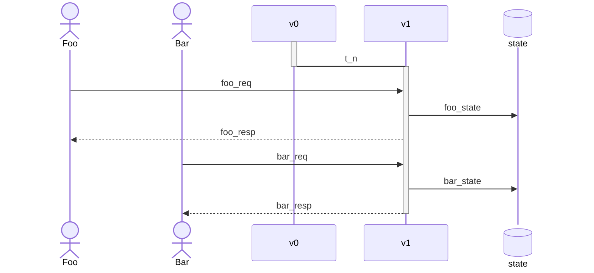
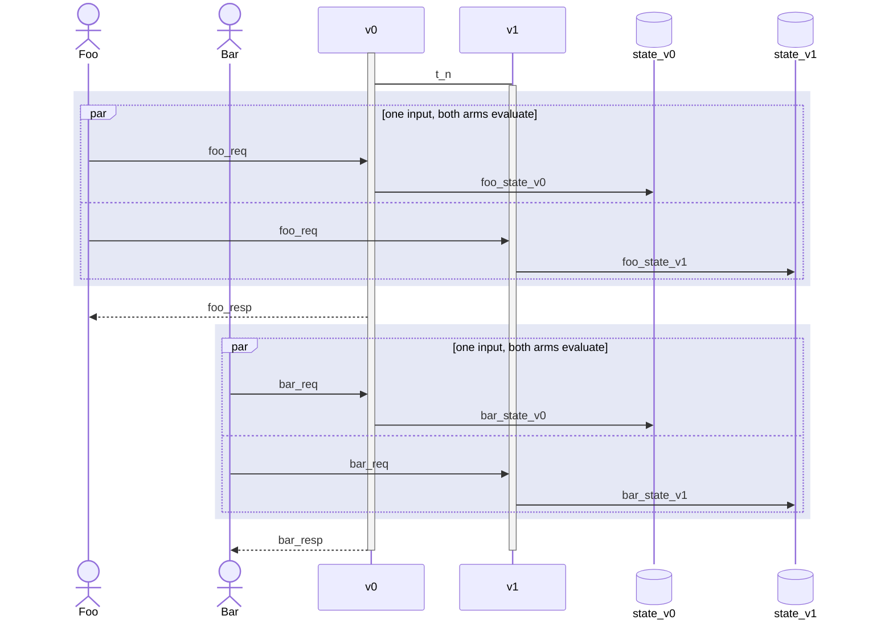
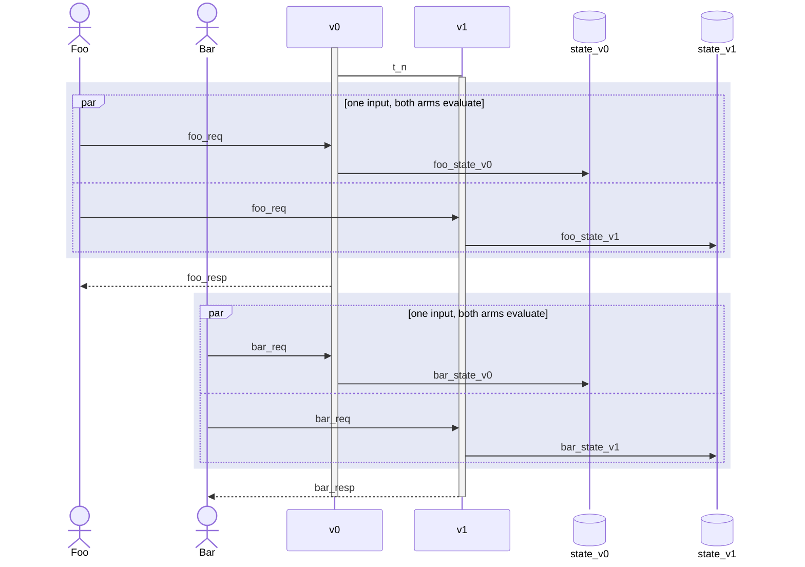
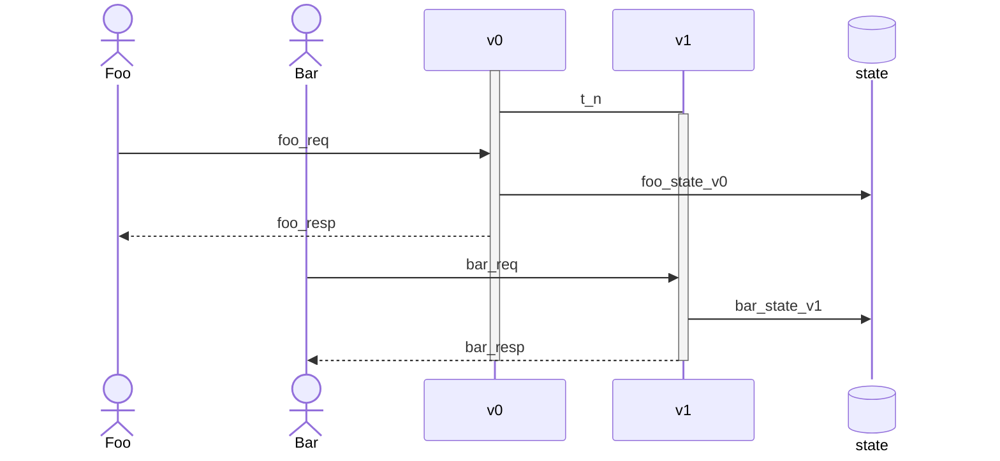
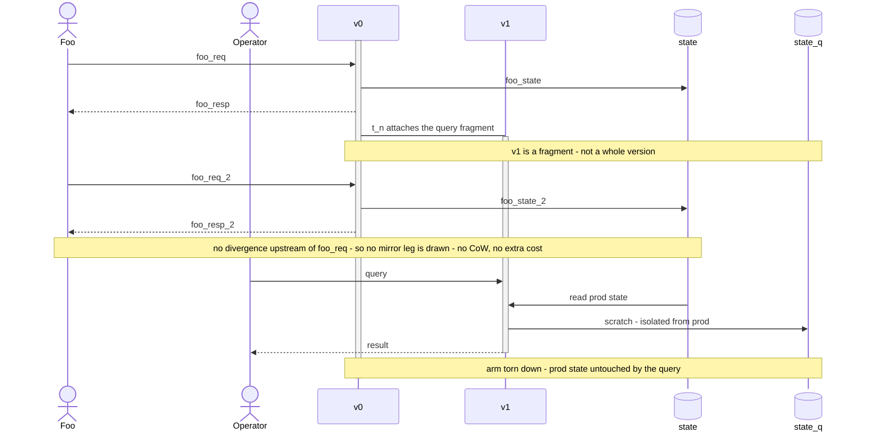
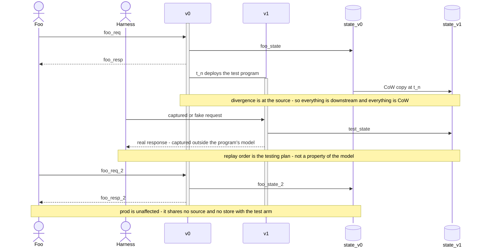
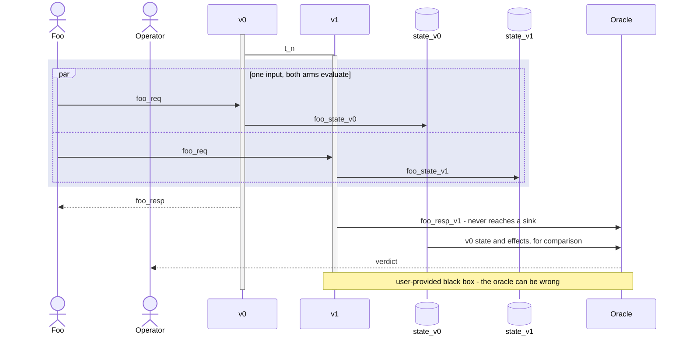
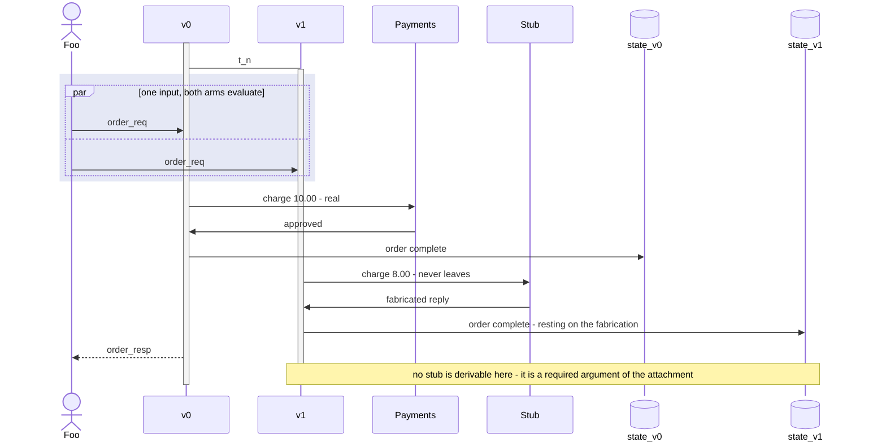

The operational configurations of [branching.md](branching.md), drawn concretely: who evaluates each input, who answers it, and which store each write lands in. That doc is the model of record and carries the argument; this note is where the dynamics are visible, which is what the usual devops vocabulary is actually about.

The deployment configurations come first, ordered as a deployment actually proceeds — upgrade, then shadow → canary → reverse shadow, then live experiment. The later sections cover the configurations that doc calls "not deployments" — an ad-hoc query, an ephemeral test environment, testing against an oracle — for which the dynamics *are* the content, and close with one boundary mechanic that is not a configuration at all: a diverged effect whose reply the arm consumes.

Two results from [branching.md](branching.md) are worth having in hand before reading the diagrams:

- **Duplicated state is what partitioning looks like when both versions evaluate every input.** How many stores a register needs is decided per register by whether a divergence is upstream of it, so an undiverged register — inventory, in a shop — is **agreed** and stays in one store in every configuration below, and only the diverged ones are copied. The copying is at the diverged entries, not at the store.
- **Shadow, canary, and reverse shadow are one mechanism with one parameter.** All three have both versions alive and evaluating every input, into their own stores. The *only* thing that changes across the three diagrams is which version's reply arrows are drawn — v0 everywhere, v0 for some users, or v1 everywhere. So each of those three sections below states its own ownership setting and its rollback consequence, and does not restate the shared structure. "Blue/green" names the *progression* through the three rather than any one of them, so the state where v1 owns everything and v0 stays current is called **reverse shadow**.

## Conventions

A legend, then the four conventions that carry the load.

- `t_n` — the "new" time at which v1 is deployed.
- `v0`, `v1` — the versioned application logic. Splitting logic from store is slightly artificial, as cambra is a unified system, but it is what makes the store choices legible.
- `state` — a store shared by both arms. Where histories are **parallel** each arm's store is named for its arm, `state_v0` and `state_v1`, so the plain name never silently changes meaning between diagrams.
- `Foo`, `Bar` — users. Bar is the one who gets the new version, the experiment arm, or the canary.

- **Activation is lifetime.** A participant is activated while it is alive and processing, and deactivated when it stops existing. Activation says nothing about who answers a request — in the mirrored configurations both versions are alive at once.
- **A reply arrow (`-->>`) marks the response owner.** Every request has exactly *one* reply, from the version that owns the effect at that position. A request leg with **no** reply is a **mirror leg**: that version evaluates the input and writes its own state, but does not answer. This is the piece that distinguishes the mirrored configurations from each other — they are otherwise structurally identical.

  Both versions always write their own response channel. Which one *leaves* is decided by the ownership function and applied by the **sink mediator**, which holds the endpoint — so a reply arrow is the mediator's decision made visible. The mediator is elided in every diagram below, since drawing it would add a participant that only ever repeats what the reply arrows already say; [branching.md, "Applying ownership at the boundary"](branching.md#applying-ownership-at-the-boundary) is where it is described.
- **An arrow *out of* a store is a read.** The deployment diagrams only ever write, so writes point at the store. The later configurations read as well, and a read is drawn `state ->> v1` — dataflow direction — so that the two are not confused. The consumer need not be a version: the oracle reads v0's store the same way.
- **A tinted region is where both versions evaluate.** In the mirrored configurations the two legs of one request are wrapped in a `par` block inside a tinted rectangle: one input, delivered to both versions, each writing its own history. No reply is emitted inside the tint — the reply arrow sits *outside* it, because who answers is a separate decision from who runs. The same request label appearing on both legs is the *same* request, not two.

## Upgrade

No duplicated state, everyone gets v1 after deployment. Only one version evaluates any given input, so there is no automatically safe rollback — the new state overwrites the old state, and there is no v0 left running to fall back to.

This is the only diagram here whose activations do not overlap: v0's lifetime ends where v1's begins, and that non-overlap *is* the absence of a fallback. Every configuration below keeps both bars alive.

---

The next three are the mirrored family, in the order a deployment moves through them. Ownership starts wholly with v0 and ends wholly with v1; nothing else changes.

## Shadow

v0 owns **every** response, so v1's behaviour is observable without being externally visible. This answers "what would v1 do to production?" without exposing v1 to anyone, and it is the only configuration whose fallback is exact: v0 owned every effect, so its history *is* what happened.

[branching.md, "Prod shadowing"](branching.md#prod-shadowing) draws the same configuration as topology rather than as a timeline, which is where the two ends become visible — one real source mirrored to both arms, and a mediator that drains v0's response channel and not v1's. Both arms write their own channel regardless; ownership is only about which one leaves. That view is also where the **shadow contract** is legible: an arm whose output reached the sink would not be a shadow, whatever it was labelled.

## Canary

A small subset of users gets the new version and is watched. **Bar's reply now comes from v1** and Foo's still comes from v0 — the canary "fraction" is nothing but how much of the reply traffic v1 owns, so it is a property of the ownership function and not of routing.

Rollback is accurate to `1 − fraction`: v0 evaluated everything, so its history is complete with respect to inputs and wrong only where the world was told v1's answer.

## Reverse shadow

Ownership has flipped wholesale: **v1 answers everything, v0 answers nothing**, and v0 keeps evaluating so its state stays current. Shadow with the roles exchanged, hence the name, and the last state on the blue/green path before v0 is retired.

Reverting is just moving ownership back — but v0's history now disagrees with what the world was told on *every* request since the cut, so this is the least accurate fallback of the three, not the safest. [branching.md](branching.md) argues that inversion under "Rollback fidelity".

---

## Live experiment

Similar to canary, but all state is in one database — so each input is evaluated by exactly one version, and that version owns its response.

Mirroring is **unavailable** here, and that is forced rather than chosen: with a single store, having both versions evaluate the same input would write every key twice, which [branching.md, "One value per key per position"](branching.md#one-value-per-key-per-position) forbids. So a live experiment has no current fallback and no rollback affordance, and that is the operational cost of sharing the store.

---

The remaining sections are not deployments. Each is one of the configurations above, entered for a different reason; [branching.md](branching.md) argues the reductions, and these diagrams show the dynamics that make them work.

## Ad-hoc query

A fragment that reads, computes, and outputs — a one-off analytics query over production data. Structurally a **canary with a teardown**: the query arm is attached, owns the effect of returning its result, and deactivates. An arm that stayed would just be a new version.

The point of the diagram is an *absence*, which no sequence diagram can draw, so the note carries it: Foo's traffic exercises no divergence, so there is no mirror leg for it at all — CoW never triggers and the marginal cost is only the query itself. Anything the fragment writes goes to a store isolated from production.

## Ephemeral test environment

Here `t_n` is the deployment of the test program itself, and the divergence is at the **source** — so every register is downstream of it and the test arm runs against a copy-on-write copy of production state. Its source carries fake or captured traffic, supplied by an environment harness; the order of that traffic is the user's testing plan and is deliberately not modelled.

Its sink is **real** — it actually serves responses — because the harness captures them from outside the program's model. Compare **Shadow** above, which makes the opposite choice at both ends: real source, output withheld at the mediator. Neither dominates, and which is available depends on what the harness can capture. Also the shape for sandboxed prod debugging.

[branching.md, "Ephemeral test environment"](branching.md#ephemeral-test-environment) draws this as topology beside the shadowing view, where the opposite choices at the source and sink ends sit side by side.

## Testing against an oracle

Shadow is the in-production form of a test: all the compute, nothing drained. What turns it into a test is an **oracle** — see [branching.md, "Oracle"](branching.md#oracle), where its role is fixed and its mechanics are explicitly TBD. It can itself be buggy, which is a property of testing rather than a flaw in the arrangement.

Note what the oracle is *not*. Not a sink: v1 emits nothing externally, and the value the oracle reads is one the mediator declined to drain, so the arrangement is exactly the Shadow diagram plus a judgement drawn off to the side. And not the ownership function either — an oracle decides whether behaviour is *correct*, never whose behaviour is *true*. Both are user-supplied predicates over the same traffic, which is why they are drawn and named separately.

## Diverged effect with a consumed reply

Not a configuration — a boundary mechanic that can appear inside any mirrored one, drawn here on **Shadow** for concreteness. The sink is a payment processor: **non-promotable**, and its reply is **consumed**, since the arm branches on the outcome. v1 diverges by charging a different amount, so there is no reply for it to borrow and its stub has to **fabricate** one.

The reply legs are drawn as reads, per the convention above, because that is what they are — the value re-enters the arm's computation. That is precisely the condition that separates this case from a sandboxed email whose reply nobody reads, which changes nothing about what v1 computes and simply does not happen.

The tint here wraps only the delivery of the input. Each arm's charge-and-write sequence is drawn *below* it rather than inside, because the order of the calls against their own reply is the whole subject; the two arms are still concurrent, and nothing about ownership is decided in the tint.

What no sequence diagram can draw is the third program: v1-in-production, which would have sent 8.00 to the real processor and might have been **declined** where 10.00 was approved. The gap is between v1-sandboxed and v1-in-production, *not* between v1 and v0 — [branching.md, "Divergent sinks"](branching.md#divergent-sinks) argues the case, including why idempotency and the source cache both fail to rescue it, and [branching.md, "Sink annotations and the required stub"](branching.md#sink-annotations-and-the-required-stub) is why the stub is a required typed argument rather than something the runtime could invent.

Had the call been *undiverged*, both arms would issue the identical charge and v1 could consume v0's real reply — one effect proved twice, no stub, no gap.

## Replication

*Stub — work in progress.* The goal is increased durability or reliability. Which of this machinery earns its keep there — CoW, source mirroring, effect capture — is unsettled, so there is nothing to draw yet.
