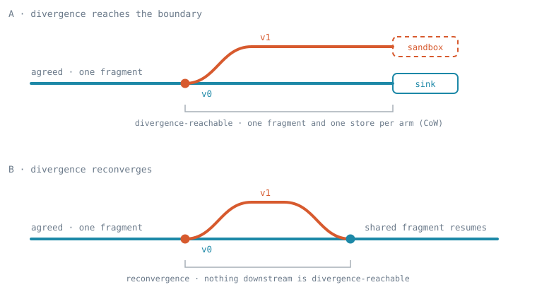
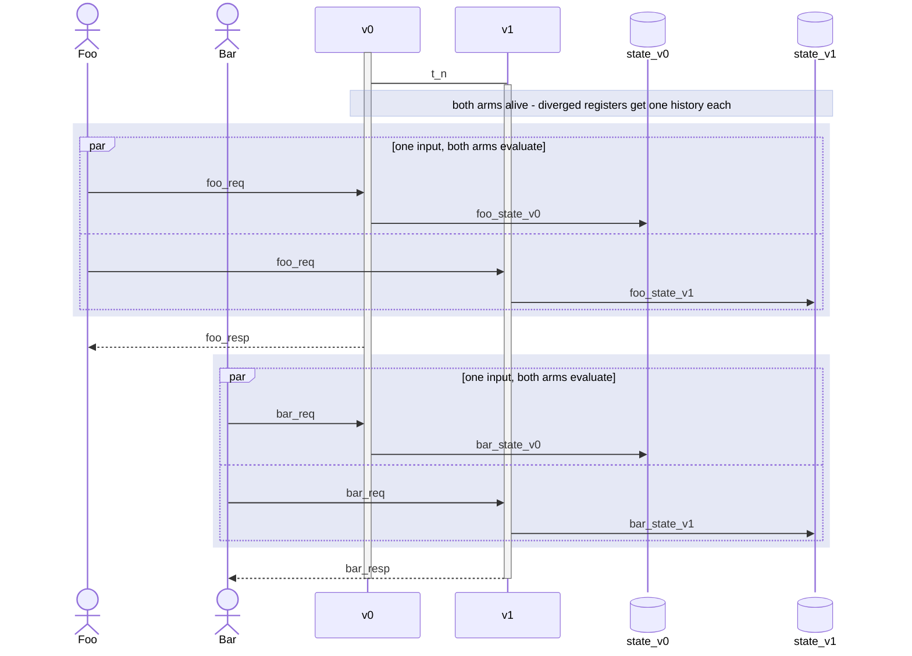
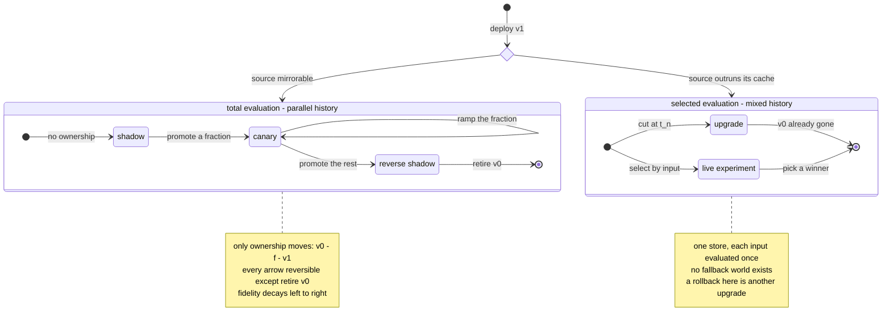
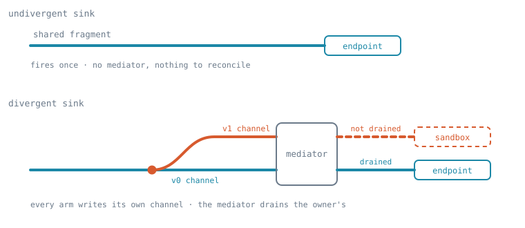
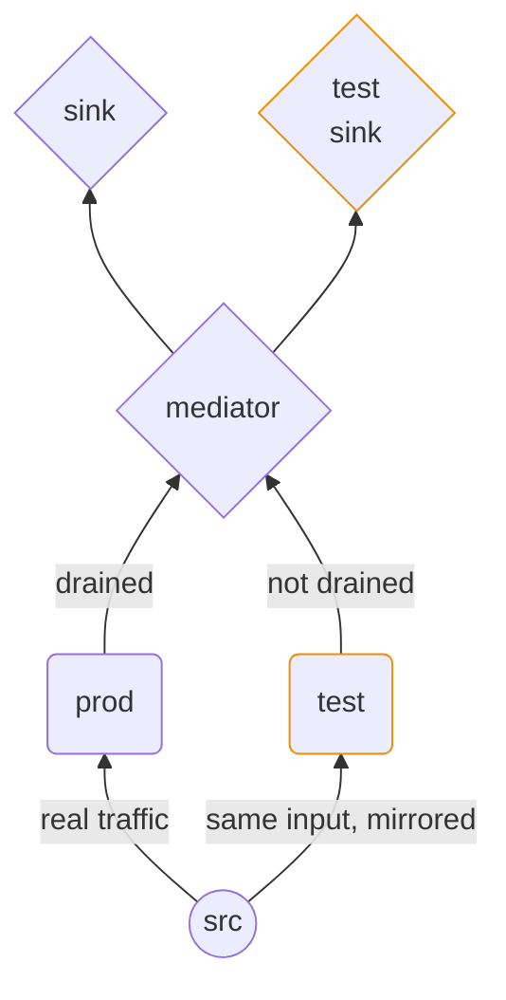
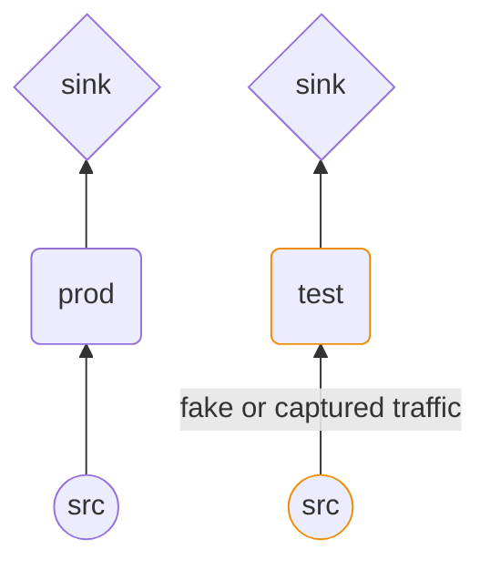

How to slice the design space of running two versions of a program at once: what an operator sets, what the compiler derives, and which familiar deployment patterns fall out. This is the model of record; [branching-sequence-diagrams.md](branching-sequence-diagrams.md) draws the configurations concretely.

> **Status: [Decided] for internal state, [Sketched] for anything touching sources and sinks.** The axes, the two laws, the per-register history derivation, and the four well-formedness conditions are settled and carry the table below. Sections on the frontier carry their own banners; "Promotion and its operations" and "Oracle" are **TODO**.

## Vocabulary

- **Arm** — one version of the program. Two arms are one tree with the differing sites selected, so they share everything they have in common. Where the diagrams say **prod** and **test**, those are v0 and v1. Two arms are emphatically *not* two running programs, and "The execution model" below is what that costs and buys.
- **Position** — where a unit of work sits in a domain the program already has: a commit on the transaction clock, or an element of an input stream. Every decision below is a function *from* a position.
- **Divergence** — a site where the two arms differ. A register is **divergence-reachable** if any divergence is upstream of it in the dataflow graph; if none is, both arms provably write it identically.
- **Partitionable** — a register or a sink that decomposes into independent per-position units. `balance[tenant]` is partitionable; `revenue_total`, a fold over every position into one cell, is not. One property, read against three things below: partitioned *evaluation* (a selector splits which arm runs), partitioned *ownership* (the mediator splits which arm answers), and promotion by pointwise selection.
- **Flip** and **ramp** — the two ways an ownership arrow is taken. A **flip** moves ownership wholesale between two constant-valued settings; a **ramp** moves it fractionally, by an input-property function with a rising fraction. The devops vocabulary is the same: a blue/green cutover is a flip, and ramping a canary is a ramp.
- **Internal and external state** — "state" throughout this doc means *internal* state: registers, which nothing outside the program mutates. **External state** is durable state reached only through sources and sinks. Almost everything settled below is a claim about internal state; the external side is the open frontier, and it is where "Effects at the boundary" starts.
- **Effect** — something a program does at a source or a sink. A write to a register is dataflow, not an effect, and nothing below restricts which direction internal state may move. An effect's result is analysable when it re-enters the program at a site Cambra can see; out-of-band causality — an email provoking a later request — is outside this model by construction rather than by omission.
- **Authoritative** — an arm's history is authoritative when it is the source of truth and that arm owns effects. **Promotion** and **rollback** are the forward and backward paths to making a history authoritative, and where a claim holds in both directions this doc says *made authoritative* rather than naming one direction.
- **Ownership function** — the function from a position to the arm that owns effects there, per "The axes". Not the **oracle** of "Oracle" below, which judges something else entirely; the two are kept apart there.
- **Sink mediator** — the runtime component that holds an external endpoint together with each arm's channel into it, and applies the ownership function to decide which arm's output becomes external truth. Every arm writes its own channel regardless of ownership; the mediator decides what leaves.

Pattern names — shadow, canary, reverse shadow, and the rest — are ordinary devops vocabulary, glossed under "The configuration space" where the configurations that carry them are set out.

## The execution model

Everything below reads against one assumption, so it is worth stating before the axes rather than leaving it to be inferred: **a deployment is one program plus fragments derived by diffing the versions.** Where the versions agree there is a single fragment, and it is executed **once**. Splitting is introduced only where they differ — at a source node, or at any interior dataflow node — and only divergence-reachable fragments are instantiated per arm.

So "both arms" is a claim about *denotation*, not about what runs. In the agreed region there are not two arms doing the same thing in parallel; there is one fragment, and the arms are two readings of a tree that mostly coincides.



**Reconvergence is a fragment-graph property.** Subfigure B closes the divergent span back into a shared fragment, and what licenses that is ordinary dataflow tracing: the span ends wherever nothing downstream is divergence-reachable. It is decided by the same analysis that derives history, so it costs no new machinery — and it is emphatically not a merge of the two arms' state. Merging parallel histories is an operation performed at *promotion* time, per "Promotion and its operations", and nothing in the branching model performs one.

**What it costs.** Not 2×. One arm's worth of compute, plus the divergence-reachable subgraph for each additional arm — so the multiplier is set by the size of the *diff*, not by the number of versions. Two consequences follow, and both matter for the table below. A small change is nearly free to mirror, which is what makes *total* evaluation affordable at all. And many concurrent versions stay affordable, because what multiplies is the diff rather than the program: n arms cost one program plus n − 1 diffs. The 2× figure is the worst case, reached only when the divergence sits at the source and every register is therefore divergence-reachable — the limiting case named under "CoW applies to fragments, not programs".

**What it buys structurally.** A divergent fragment has its own store by construction, so copy-on-write is a consequence of where the split sits rather than an overlay the runtime maintains and checks. The sandbox's *extent* is derived, not chosen — which is the claim "CoW applies to fragments, not programs" makes from the other direction.

Whatever form the splitting operator takes, its semantics have to say where effect ownership sits, since the duplication it introduces is exactly the duplication the two laws constrain.

## The axes

A version attachment has to answer one question per side of the system — who runs, who is believed, what is remembered:

| axis                 | what it decides                                                                                  | settings                                                                                                                                         |
| -------------------- | ------------------------------------------------------------------------------------------------ | ------------------------------------------------------------------------------------------------------------------------------------------------ |
| **evaluation**       | which arms run at a position                                                                     | *selected* — exactly one arm, chosen by the commit clock or by a property of the input — or *total*: every arm at every position, i.e. mirroring |
| **effect ownership** | which arm's effects are external truth at a position                                             | one arm, named by a constant, by the commit clock, or by a property of the input                                                                 |
| *history* (derived, not set)  | per register: how many stores it needs, and whether any arm holds a world that could be restored | **agreed**, **mixed**, or **parallel** — derived below                                                                                           |

**Mirroring** is the *total* setting seen from outside: every arm's logic is exercised at every position, rather than each position being handled by one arm. Read against "The execution model" that is narrower than it sounds — the agreed prefix is evaluated once, and only the divergent fragments run per arm — but from outside the effect is the same: mirrored arms all compute and all write, and only one of them answers. **Source mirroring**, where the runtime forks a source's incoming elements, is the limiting case, with the split placed at the source.

**Why these and not others.** Evaluation and ownership are independent, and mirroring is the proof: an arm can run without answering. The arm that answers is necessarily an arm that runs. Mirroring is what makes shadow, canary, and reverse shadow available at all.

History is not independent of them, so it is derived rather than set. Whether a register needs its own store per arm is a question about the *program* — is a divergence upstream of it — and the shape of the answer is fixed by the evaluation setting.

Both evaluation and ownership are functions from a position to one or more arms, and both draw from the same small set of domains: a **constant**, the **commit clock**, and a **property of the input**. Naming that shared vocabulary is what makes the configurations below look like a grid — the same choices appearing in two places. Evaluation is the one gap: a constant evaluation setting would mean only one arm ever runs, which is not a two-arm deployment, so the constant domain appears under ownership only. "A property of the input" splits two ways, below.

### Who computes the ownership function

"A property of the input" hides two very different things, and Cambra needs both:

- **Envelope-defined** — computable from what the runtime can see without running the program: a source address, a header, TLS SNI, a path prefix, an assigned request id. Available before dispatch, and definitionally upstream of every divergence. *"Mirror everything to this shadow instance", "canary these address ranges"* are of this kind, and this is the sense in which ownership can be pure infrastructure.
- **Program-defined** — a function of parsed input, and possibly of state: canary the beta cohort per the `users` table, or orders above some value. Deciding who owns now requires running program logic.

The second is what users will actually reach for, and it is safe under the **undiverged ownership predicate** condition rather than in general. That condition is a condition on the *predicate*, not on the program: a program may diverge as wildly as it likes and still segment ownership by a cohort lookup, provided the lookup itself is undiverged. Segmenting on a request id can be either kind, and the condition is why it does not matter which — envelope-defined ownership satisfies it trivially.

**Program-defined *selection* is harder than program-defined *ownership*.** Under *total* evaluation an ownership predicate is ordinary agreed-region computation: both arms run regardless, so the predicate is evaluated by logic they share. An evaluation *selector* has a bootstrap problem — something must decide who runs before anything runs, so the predicate has to be evaluable by the runtime, or by an agreed prelude ahead of dispatch. This is the same shape as the argument under "Parallel histories require total evaluation" that mirroring buys its way out of generalized merging: another thing the cost of mirroring pays for.

## History, per register

The derived axis, defined here because the table below reports it. Three modes: **agreed** is decided by the compiler outright, and the choice between the other two follows from the evaluation setting alone.

The available patterns are decided by **divergence reachability**, which under this model stops being a cost optimization and becomes the load-bearing analysis.

- **agreed** — no divergence is upstream, so both arms write the register identically. One store.
- **mixed** — a divergence is upstream, there is one store, and the two arms' contributions interleave. Irreversible in principle: commits may be attributable to a writer, but **reads cross arms**, so v0 may read v1's writes. There is no v0-only history to recover, because v0 never ran against a v0-only world.
- **parallel** — a divergence is upstream and each arm has its own store of the diverged values, each internally pure and **each current**: every arm's store is a world that could be made authoritative. Currency is part of the definition, not a bonus, and it is what the next subsection turns on.

The derivation, per divergence-reachable register:

- *total* evaluation → **parallel**, since both arms process every input, so both stores stay current.
- *selected* evaluation → **mixed**, always.

### Parallel histories require total evaluation

The second line of that derivation deserves its own argument, because a store-per-arm under *selected* evaluation looks available and is not. Nothing stops a runtime from allocating two stores; what it cannot produce is a store that is a **world**. Both cases fail, and they fail differently:

- **The selector does not partition the register's key space.** A user-id hash against a global register: each store sees only the positions its own arm handled, so each is a partial fiction from its first write. Neither is a world because neither is complete.
- **The selector does partition it.** Selector on tenant-id with per-tenant state, which is the case that looks like it works. For key `balance[A]`, only v1 ever wrote — there is no v0 value of `balance[A]` to fall back to, because v0 never ran for tenant A. The two stores are disjoint, so "two stores" is a representation choice rather than a semantic one, and reverting a tenant means taking the state v1 left and **migrating** it under "State compatibility". A migration is not a restore.

Snapshotting a slice before the cut does not rescue the second case. A snapshot stops tracking inputs the moment its arm stops evaluating them, and *current* is precisely what distinguishes a parallel store from a backup.

So parallel history and total evaluation are the same claim from two sides, and this is why the mirrored rows are worth their compute. Generalizing *selected* evaluation to parallel state does not stop at one register: it would need **all** state to partition identically along the version lines, and rejoining the arms would then need a generalized merge over two diverged histories. Mirroring buys its way out of both — pay for the divergent fragments, avoid generalized merging entirely, and get a fallback that is current rather than partial. Per "The execution model" that price is the size of the diff rather than a second copy of the program, which is what makes the trade a good one rather than merely an available one.

Whether the selector partitions still decides something, just not the history mode: it decides **when state compatibility bites**, per that condition.

## Laws and well-formedness conditions

Two laws and four conditions, all static properties of the program, and all of one kind: they say which configurations mean anything. Everything below this section is read against them.

### Ownership is grounded

The owner at a position must be an arm that evaluates at that position — you cannot answer with logic you did not run. So under *selected* evaluation ownership is **forced** (only one arm ran, so only one candidate exists), and it is free only under *total* evaluation. This is why the mirrored patterns read as one design with a parameter while the selected ones read as separate designs.

### One value per key per position

Two arms may both write a key if and only if they provably agree — then it is one write proved twice, not two writes. They may disagree only with isolated stores (**parallel**, one store per arm). This is what makes things like a shared inventory safe under mirroring: both arms decrement it identically, so there is no double-selling.

The law is denotational, and the execution model discharges it structurally. An agreed key is written by the shared fragment, so operationally there is one write, executed once, with nothing to reconcile at runtime — "proved twice" describes the reasoning, not the work.

### Undiverged ownership predicate

The owner at a position must be computed with no divergence upstream of the predicate — in the **agreed** region. Otherwise the two arms compute *different owners for the same position*, and "which arm's effects are external truth" has no answer.

This is grounding's sibling: grounding says the owner must be an arm that ran, and this says the *choice* of owner must be one both arms make identically. It is decided by the same divergence-reachability analysis that derives history, so it costs no new machinery, and it is what licenses program-defined ownership per "Who computes the ownership function".

### State compatibility

A *mixed* history is safe only if each arm can read what the other wrote, and that is statically decidable — it is the useful thing the compiler can say about a shared-store deployment:

```
# Safe: v0 reading v1's records is unaffected by the added field
v0 writes {Name: "John"}
v1 writes {Name: "John", LastName: "Doe"}
```

```
# Unsafe: v0 enforces that names are capitalized and v1 relaxes it,
# so v0 cannot safely operate on v1's data
v0 writes {Name: "John", LastName: "OCallahan"}
v1 writes {Name: "John", LastName: "oCallahan"}
```

Whether the selector partitions the register's key space decides **when** this bites, which is the one thing partitioning still decides after "Parallel histories require total evaluation". This is **partitioned evaluation** in the sense of "Vocabulary", and it takes two things: the register must be partitionable, and the selector must cut along its keys. The user-id hash above has the first and lacks the second; the tenant-id selector has both.

- **It does not partition.** Reads cross arms while the deployment runs, so compatibility is a precondition of running at all. With per-user state and a random v0/v1 shard, every request must see the *real* per-user state, so under compatibility v1's state should deliberately **not** be sandboxed.
- **It does partition.** No read ever crosses arms, so nothing is required to run. Compatibility becomes the precondition of *reverting* a slice: the migration that moves tenant A back to v0 has to produce records v0 can read.

It is also the precondition a merge of two parallel histories needs, per "Promotion and its operations" — the compiler can say the second case above is unsafe to merge before anyone tries. Note that CoW/sandboxed semantics are safe in *both* cases; compatibility is about rejoining, not about running.

### Sandbox containment

A fabricated reply — what a stub returns to a non-owning arm at a diverged, non-promotable sink, per "Sink annotations and the required stub" — must reach only **parallel** registers. Contained there, the consequence is a preview of unknown fidelity and nothing worse. Reaching an **agreed** or **mixed** register, the stub's fiction becomes part of v0's world, and no annotation makes that acceptable: it is an error rather than a warning.

### External-effect-recording registers

A history can be made authoritative only for registers *derived from inputs*, never for registers that *record external effects*. Internal register writes are dataflow, not effects, and are unrestricted; the condition is about records of what happened at the boundary, and it is symmetric in direction:

- **Rollback** — restoring `revenue_total` to v0's version makes the books disagree with the payment processor.
- **Promotion** — taking on v1's `emails_sent` leaves durable state asserting emails that were never sent.

In both directions you would be taking on a history whose claims about the external world are false. Ownership enters only here: for a register that records an external effect, the non-owning arm's record is a lie, so only the owner's is usable.

Three cases, and the middle one is what makes a sandboxed datastore work at all:

- **Input-derived** — freely made authoritative in either direction, with no ownership requirement. Reading it otherwise would contradict shadow, per "What promotion requires".
- **Records a promotable external effect** — made authoritative together with that effect. The sandboxed datastore and the register noting what was written to it move as one.
- **Records a non-promotable external effect** — never made authoritative from a non-owning arm.

So a register's adoptability follows the promotability of the effect it records, which makes this the same correspondence as the one under "Sinks" rather than an independent rule.

## The configuration space

Five configurations, over *evaluation* × *ownership*, with history derived. Under *selected* evaluation ownership is forced, so the only remaining freedom is the selector's domain — the commit clock or a property of the input. Under *total* evaluation ownership is free across its own domains, less the one that is not a configuration at all: a clock-valued ownership function is a *move* between two configurations, so it appears in "Flows, not states" as an arrow rather than here as a row. That leaves constant v0, constant v1, and a property of the input.

The **answers** column reports whose output becomes external truth for two users, Foo and Bar, Bar being the one who gets the new version — the experiment arm, or the canary. They are the same pair throughout [branching-sequence-diagrams.md](branching-sequence-diagrams.md) and in "Concretely: canary" below.

| pattern | evaluation | ownership | answers (Foo / Bar) | history of diverged registers | rollback fidelity |
| --- | --- | --- | --- | --- | --- |
| **upgrade** | selected by clock | **forced** — only one arm ran | v1 / v1 | **mixed** — one store, no restorable world | none |
| **live experiment** | selected by input property | **forced** — only one arm ran | v0 / v1 | **mixed** — one store, no restorable world | none |
| **shadow** | total | constant v0 | v0 / v0 | **parallel**, both current | exact |
| **canary** | total | by input property | v0 / v1 | **parallel**, both current | wrong on the canary fraction |
| **reverse shadow** | total | constant v1 | v1 / v1 | **parallel**, both current | wrong on everything since the cut |

The history column is derived rather than chosen, per "History, per register": `total` gives **parallel** and `selected` gives **mixed**, with nothing else to consult. Only diverged registers are reported — undiverged ones are **agreed** and stay in one shared store in every row, mirrored ones included. The last column is explained under "Rollback fidelity".

Reading the last three pattern rows top to bottom, the only *setting* that changes is who answers — sliding `(v0, v0) → (v0, v1) → (v1, v1)`, the canary fraction going 0 → f → 1. Everything else about those three rows is identical, which is the claim that they are one mechanism; the fidelity column is a consequence of the setting, not a fourth dimension. Read downward they are also the states a deployment passes *through*, which is "Flows, not states" below.

Wherever *input property* appears, the predicate may be either **envelope-defined** or **program-defined**, per "Who computes the ownership function" — the latter subject to the undiverged-predicate condition.

What each pattern means in ordinary infrastructure terms:

- **upgrade** — ship the new version, everyone gets it, the old one stops running. The store carries on across the boundary. No fallback.
- **live experiment** — an A/B test on one database. Some users get v1's pricing; there is one inventory, and it is *real* for both arms, which is what makes the measurement meaningful. Not undoable, because the two arms' contributions to the shared store interleave. **A classic tenant-by-tenant rollout is this row** with a selector that partitions: how multi-tenant SaaS actually ships today, and reverting a tenant is a migration of that tenant's slice rather than a rollback. Cambra can run the same rollout as a **canary** instead, which is the safer form and is where the distinction is drawn. Both selected rows evaluate each input's divergent work once regardless of how many arms are live — but per "The execution model" the mirrored rows already share everything the arms agree on, so what selection saves is n − 1 copies of the *diff*, not of the program. That is a far smaller saving than it looks, and it is bought at the price of the fallback. Selection is for the case where mirroring is *unavailable*, per "Not every path is open", rather than the case where it is merely expensive.
- **shadow** (dark launch) — v1 processes real production traffic and answers nothing. Its state evolves so you can ask "what would v1 have done?" without exposing it.
- **canary** — v1 answers a small fraction of traffic and is watched, with the fraction ramped up. Same machinery as shadow; the fraction *is* the ownership function. **Tenant-by-tenant belongs here too, and this is the safer way to run it**: make tenant id the *ownership* function rather than an evaluation selector, and both arms evaluate every tenant, so v0's store stays current for the tenants v1 owns. Reverting one is then a rollback rather than a migration, wrong only about what those tenants were told, per "Rollback fidelity". The cost of *total* evaluation — one shared fragment plus the divergent diff, per "The execution model" — is what buys that, and it is the trade the classic form declines.
- **reverse shadow** — ownership has flipped to v1 wholesale, and v0 keeps evaluating everything so it stays current and can be flipped back. This is the state people are usually pointing at when they say "blue/green", but blue/green is better used for the whole progression that ends here; see "Flows, not states".

### Concretely: canary

Reproducing [branching-sequence-diagrams.md, "Canary"](branching-sequence-diagrams.md#canary), because the shape is worth having in front of you. Both arms are alive and **both evaluate every request**; the tinted regions are where that happens, and no reply is emitted inside them. The reply arrow sits *outside* the tint, because which arm answers is the separate decision:



Every mirrored configuration has this shape. The rest of [branching-sequence-diagrams.md](branching-sequence-diagrams.md) draws the others.

## Authoritative state: promotion and rollback

The table above enumerates *states*. This section is about **moving** between them, which always means moving ownership — making some arm's history **authoritative**. The two directions have different characters: **promotion** is constrained by what the boundary allows, since an effect that cannot be made true cannot be promoted, while **rollback** is available wherever a parallel history exists but is lossy by a measurable amount. Which moves are legal at all comes first.

### Flows, not states

Every row above is a *state*. A deployment is a *path* through states, and most of the things practitioners name — "blue/green", "fork and cutover" — are paths rather than states. Keeping the two apart is what stops the table from acquiring a row per devops idiom.



The two boxes are the derived history axis, so the picture carries the same claim the table does: *total* gives **parallel** and *selected* gives **mixed**, with nothing else to consult. The branch at the top is not an operator's preference — it is the precondition of [Not every path is open](#not-every-path-is-open) below, which decides which box a program can enter at all.

The left-hand box is what "blue/green" ought to name: **shadow → canary → reverse shadow → retire v0**. Only the arrows to `retire v0` and out of the choice are one-way; the promotions within the box are all reversible, and they are drawn forward-only because the progression left to right is the thing worth reading. Each arrow moves *ownership only* — evaluation is *total* throughout, and no register changes its history mode along the way. That is why it is one deployment rather than three. Clock-valued ownership is how a **flip** is taken, and the states at either end of one are constant-valued; the `canary → canary` self-loop is a **ramp**, an input-property function with a rising fraction.

The right-hand box holds two unrelated one-shot flows rather than a progression. They share a box because they share a history mode, not because either leads to the other.

**Fork and cutover is not a separate pattern.** Copy traffic to the new arm all the way through to its sinks, have it distinguish real sinks from copied ones, then cut over at the sink level: that is shadow followed by promotion, i.e. two arrows of the shadow → canary → reverse shadow path. What looked like a distinct design was the *kinetics of the drain*.

#### Not every path is open

What closes a path is always an effect, never the internal state. Entering at shadow requires a source that can be mirrored for as long as the shadow runs: an unreplayable source is mirrorable only within its **source cache** window, so a program that outruns that window has no shadow available past it, and its only routes are upgrade and live experiment. That is the branch at the top of the diagram above, and it is why the two boxes are reachable under different conditions rather than being alternatives an operator picks between. Moving *along* the path requires promotable effects, per "What promotion requires".

A second closer acts *within* the mirrored box rather than at its entrance. The `shadow → canary` arrow needs the mediator to apply ownership per position at every divergent sink, so a sink that is not partitionable — one nightly aggregate report, one actuator setpoint — closes that arrow and leaves only the flip to reverse shadow. What that costs is the subject of the next subsection.

#### What canary is for

Canary is not a station every deployment stops at. It is the intermediate ownership setting, and it is bought with a reality gap: while it runs, v0's history disagrees with what the world was told on the fraction v1 owned, per "Rollback fidelity". What that gap buys is **ground truth the shadow record could not give you** — so canary's value is inversely proportional to how far the shadow record can be trusted, and that is decided by the same promotability split read forwards.

Where every divergent sink is promotable, its sandbox is a real instance of the same kind and answers truthfully, per "Sinks". The shadow record is then a faithful account of what v1 would have done, an oracle can reach a verdict while v1 owns nothing, and the **flip** straight to reverse shadow is available. By the error measure under "Rollback fidelity" it is also the *lower*-error path: error goes as fraction × duration × per-event delta, and a validated flip holds the fraction at zero for the whole validation window where a long ramp accrues gap the entire way up.

Where a divergent, non-promotable sink's reply re-enters the computation, part of the shadow record rests on a stub, and no amount of shadowing turns a stub into a real reply — a real reply to a real request exists only once the arm owns the position. Ownership has to be ramped. The compiler's enumeration of fabricated-reply sites, per "Sink annotations and the required stub", is what distinguishes the two cases: an empty enumeration licenses the flip.

Two independent properties of a sink decide this between them, and it is worth seeing that they are independent:

| | promotable | non-promotable |
| --- | --- | --- |
| **partitionable** | per-tenant datastore rows; per-request output files; object-store writes keyed by request id | HTTP responses; per-user emails; per-order payment charges |
| **whole-sink** | a nightly aggregate report; a rebuilt search index; a materialized rollup | an actuator setpoint; a broadcast webhook consumed as authoritative-and-total; an append-only log a downstream reads as one sequence |

A nightly report is promotable — v1's file can be swapped in as truth — but no one can own half of it. A payment charge is partitionable, since ownership is per order, but nothing about it is recoverable after the fact. So the two axes move independently, and together they say which ownership-moves exist at a divergent sink:

| | record faithful | record rests on stubs |
| --- | --- | --- |
| **partitionable** | flip, validated in advance — or ramp anyway, for graduated exposure | **ramp** — the only way to get ground truth |
| **whole-sink** | flip, validated in advance | flip, unvalidated — reversible, but no evidence before the cut |

The bottom-right cell is a real position rather than a failure, and it is worth saying why: evaluation is still *total*, so the history is still **parallel** and v0's store is still current. What is missing is the pre-cut verdict, not the fallback. That is strictly better than the **upgrade** row, which has a *mixed* history and no fallback world at all — and upgrade remains perfectly available to a program that wants it, per "Flows by increasing safety".

#### Flows by increasing safety

1. **Upgrade / YOLO.** Fine for a surprising number of use cases. A rollback is just another upgrade in the same sense, and rollback fidelity is correspondingly hard to reason about — there is no fallback world, so the question has no local answer.
2. **Forked logic, shared store.** The **live experiment** row, and what a "blue/green" runbook usually describes when the database is *not* forked — including a classic application deploy performed independently of its database, which lands here rather than on the shadow → canary → reverse shadow path however it is named.
3. **Hot/hot blue/green.** The shadow → canary → reverse shadow path, entered at shadow. Best-case rollback fidelity: *completely* safe while shadowing, since v1 owns nothing, and safe across the rest of the lifecycle only to the extent the effect semantics allow.

### What promotion requires

The forward direction. Promotion makes a non-owning arm's history authoritative, and three things gate it — all properties of the boundary rather than of internal state, which is why [Not every path is open](#not-every-path-is-open) above is always about effects.

**The sinks must be promotable.** A program whose sinks are all non-promotable can shadow indefinitely and never promote: there is nothing to make true. Non-promotable effects do not become promotable by waiting, either — a queued email is not sent at promotion time, because the moment it was due has passed. Such a sandbox is an observation record, permanently. That bounds the *flow* and not the value: observation is exactly what a shadow is for, per "Sinks", so shadowing and validating forever is a legitimate terminal configuration rather than a stuck one — it is what "Testing" and "Ad-hoc query, debugging, introspection" are.

**Only input-derived registers travel.** A register recording an external effect its arm did not own asserts a falsehood, and promoting it writes that falsehood into the source of truth — "External-effect-recording registers" in its forward direction. It is what stops v1's `emails_sent` from promoting while v1's sandboxed datastore does.

**Fabricated replies have to be weighed.** Where a diverged, non-promotable sink's reply re-entered v1's computation, part of v1's history rests on a stub — "Divergent sinks". Nothing forbids promoting such a history, and the compiler's enumeration of those sites is what an operator has to read before doing it.

What promotion notably does **not** require is that the promoted arm previously owned anything. Under *total* evaluation a shadow owns nothing at all, yet its input-derived state is complete and current — that is shadow's entire value proposition, and any reading of the conditions above that forbids it has over-generalized.

### Promotion and its operations

> **Status: TODO.** The operation is settled in outline; what is marked TBD at the end is not.

The section above says what *gates* promotion. This one says what promotion *does*, which is a different question and until now an unstated one.

Promotion is an operation on **stores**, not on the fragment graph. It is emphatically not the reconvergence of "The execution model": that is a static property of the dataflow, it holds continuously while the deployment runs, and it involves no state at all. Merging two arms' histories happens here and nowhere else.

Which operation applies is decided by the same two sink properties that decide the flows, so the table under "What canary is for" does a second job:

| | promotable | non-promotable |
| --- | --- | --- |
| **partitionable** | **merge** — pointwise selection | nothing to make authoritative |
| **whole-sink** | **overwrite** — wholesale | nothing to make authoritative |

**Merge needs no new law.** Under *total* evaluation both stores are current for every position, but each is only *authoritative* for the positions its arm owned. So the merge is the **ownership function applied pointwise over the parallel stores** — the object the model already defines, used at promotion time instead of at emission time. Where ownership cannot be applied per position there is nothing to select with, and the only available operation is to take the promoted arm's store wholesale.

"State compatibility" is the precondition: the merged store has to be one the surviving program can read, and the compiler can say a case is unsafe to merge before anyone tries. "External-effect-recording registers" is the other constraint and it is orthogonal — it decides *which* registers may travel at all, independently of how the ones that travel are combined.

**Cumulative registers are the hard case, and overwrite there is wrong rather than merely imprecise.** A cumulative register is not partitionable — it is a fold over every position into one cell — so pointwise selection has nothing to select against. Worse, under a ramp *neither* arm's fold is authoritative: with v0 owning 95% of orders, v0's `revenue_total` folds v0's prices over **all** orders and v1's folds v1's prices over all orders, while the true figure is v0's prices on the 95% it owned plus v1's on the 5% it did. No arm computed that. Recomputation is the only correct answer whenever the owned contributing set changed during the window.

This is also the quantity "Rollback fidelity" measures without naming its cause: the error it reports for a cumulative register under a canary is exactly the fold's disagreement with the ownership assignment.

The corollary is an asymmetry between the two moves of "Vocabulary". Under constant ownership across the whole divergent window the owner's fold *is* correct, so a **flip** is cumulative-safe where a **ramp** is not — a second argument for the flip wherever "What canary is for" makes it available, and one that is independent of validation cost.

**TBD:** whether promotion is atomic across many sinks and registers at once, and what a partial promotion would mean; and whether promotion is itself a position on the commit clock, which it must be for a rollback to have a point to name.

### Rollback fidelity

"Is this rollback safe?" is two questions, and only one of them has an answer:

- *Can we recover to a point where all **future** effects will be correct?* Yes — that is exactly what a parallel history buys, and it is the whole value proposition. Rollback reaches future effects only.
- *Can we prove that all effects **were** correct, i.e. that they are what v0 would have produced?* No, and not for want of bookkeeping. The effects that were emitted are gone; non-promotable ones especially. So check your dry runs — bearing in mind that a dry run's verdict is only as good as the stubs its data rested on, per "Sink annotations and the required stub".

History decides whether a fallback world exists at all; ownership decides how far that world has drifted from what actually happened. Both are needed, and the second is the one people get wrong.

Restoring state is not undoing effects. An order shipped at $8; making v0's parallel history authoritative does not un-ship it, and v0's history actively *disagrees with reality* by recording that order at $10. A parallel history is not an undo — it is a fallback whose error is measurable, and the measure is how much ownership the fallback arm held:

| | v0's ownership share while v1 was live | v0's history vs. what the world was told |
| --- | --- | --- |
| **shadow** | 100% | exact — v0 owned every effect, so its history *is* what happened |
| **canary** | 1 − canary fraction | disagrees on the fraction of requests v1 owned |
| **reverse shadow** | 0% | disagrees on every request since the cut |

Two quantities hide in that middle row and it is worth keeping them apart. **How many positions are wrong** is exactly the fraction v1 answered — v0 evaluated everything, so its history is complete with respect to *inputs*, and wrong only where the world was told v1's answer instead. **How wrong a given register is** compounds: for a cumulative register the error is roughly fraction × duration × per-event delta, so a 5% canary mispricing orders for a week leaves `revenue_total` wrong by a week's worth of mispricing on 5% of orders — not by 5%. The second is why "small fraction, short window" is the actual safety property rather than a rule of thumb.

This inverts the folklore. Reverse shadow has the *least* accurate rollback of the three: v0's store is current with respect to inputs and wrong with respect to what was said. Canary is safer than reverse shadow for the reason it is usually justified on other grounds — less ownership is a smaller reality gap. Shadow is the only exact one, which is a better argument for building it first than "it has no routing complexity." Read against the flow diagram, accuracy decays monotonically left to right across the mirrored box, and it is ownership rather than time that decays it.

### Reversibility is not a property of the deployment

A single deployment has registers in different history modes at once — diverged pricing state mixed, inventory agreed. So "can I roll this back?" is not one answer about the release; it is a question about *which registers are divergence-reachable, and which of those record external effects*. The same holds of "can I promote this?", by the symmetry of that condition. Both are answerable statically, and a per-register answer is a far better thing for the compiler to hand an operator than a yes/no.

## Effects at the boundary

> **Status: [Sketched]**, except where a subsection says otherwise.

Both laws above are about *internal* registers and about which arm answers. Neither reaches the question the mirrored configurations actually raise: the non-owning arm still runs, and running means touching sources and sinks. This section is what licenses the *total*-evaluation rows at all.

### Sources

A source is **replayable** if it can hand over the same bytes repeatedly — a function from position to content, with nothing in the source itself changing when it is read. A replayable source can be mirrored freely.

An **unreplayable** source holds state, and advancing it changes the world: consuming from a Kafka partition moves an offset, and a source holding a receiver cannot hand the same element to two callers. Even where the advance is a separate call from the fetch, it is conceptually part of the read. So **reading can be an effect**, and effect ownership has to be defined at sources too, not only at sinks.

Cambra can mirror both kinds. For an unreplayable source the mirrored window is bounded by a configurable **source cache**: the runtime retains what it fetched, so a non-owning arm consumes the same elements without a second advance. Exceeding the window is what closes the mirrored configurations to a program, per "Flows, not states".

### Sinks

**A divergent sink needs suppression or sandboxing.** An undivergent sink is reached by the shared fragment and fires once: there is no non-owning arm to reconcile with, and no mediator involved at all, per "The execution model". A divergence-reachable sink is the different case — each arm's fragment writes its own channel, only one of them may reach the endpoint, and the rest must be directed somewhere isolated or, where the runtime holds the endpoint, never emitted, which is "Applying ownership at the boundary" below. Which of the two is available is a property of the sink, not of the deployment.



**What a withheld effect is worth.** A suppressed or sandboxed effect is not waste, and reading it as waste is what makes a shadow look pointless. **Observation** is available for every one of them regardless of promotability, and it is what a shadow is *for*: an oracle reads the value the mediator declined to drain and reaches a verdict, per "Oracle".

Suppression and sandboxing differ here, and not only in mechanism. A *suppressed* email yields the fact that it would have fired. A *sandboxed* email sink yields the rendered body, which an oracle can diff against v0's. Identical promotability — neither can be sent later — and very different validation value, which is a reason to prefer a sandbox wherever one can be stood up. What bounds the worth of either is stub fidelity, per "Sink annotations and the required stub".

**Promotable and non-promotable effects.** The second use of a withheld effect is **promotion** — the sandbox becoming the source of truth when a test arm becomes production — and that one *is* gated:

- **Promotable** — output files, a durable datastore. The sandbox can become the new source of truth.
- **Non-promotable** — an HTTP response, an email. These can only be suppressed or *faked*. Nothing about them is recoverable after the fact.

This split does a second job below: a promotable sink's sandbox is a real instance of the same kind, so it can answer truthfully, while a non-promotable sink's sandbox has nothing behind it and can only fabricate. That is what decides whether a shadow record can be trusted, and so whether a deployment needs a ramp at all, per "What canary is for". It is also what "External-effect-recording registers" keys a register's adoptability to.

### Divergent sinks

Two independent things go wrong when a divergence reaches a sink, and separating them is what keeps the analysis honest — a mechanism that handles one need not handle the other:

- **The effect must not happen twice, or at all from a non-owner.** Sending an email consumes nothing on return, and it is still not something two arms may both do.
- **The reply feeds the arm's computation.** `outcome = payments.charge(...)` followed by a branch on the outcome; a datastore insert returning a server-assigned key; a compare-and-swap; a lease acquisition reporting whether it was granted. The decoupled form is the same situation — a divergent fragment writes a durable store and a downstream node reads it back. Both are analysable because the re-entry site is one Cambra can see; the limit is the out-of-band causality excluded under "Vocabulary".

The first is ownership's job and "Sinks" settles it. The second is the one with no clean answer, and it is the rest of this section.

**Idempotency is not a way out**, and it is worth saying why it fails twice over rather than once. Where the call is divergence-reachable the arms' calls differ, so there is no "same call" for idempotency to be a property of. Where it is not, "The execution model" has already disposed of the problem: the call sits in the shared fragment and is issued once, so there is no second call to excuse. It is not a weaker sibling of suppression and sandboxing — it is a non-participant.

**Nor does the source cache extend to cover it.** That mechanism works by handing over bytes that were genuinely fetched, and for a request nobody sent there are none. Its actual job is the read-side one: fanning a single real external interaction out to the divergent fragments at a split point, bounded by the window under "Sources".

So where the sink is divergence-reachable and non-promotable and its reply is consumed, v1 charges $8 where v0 charges $10 and a sandboxed v1 gets a **fabricated** reply. The gap that opens is easy to misname. It is *not* v1 against v0 — that difference is the entire purpose of the exercise. It is **v1-sandboxed against v1-in-production**: three programs, not two. The $8 charge might be declined where the $10 charge was not, by a fraud rule or a currency minimum, so v1's shadow history records a completed order where prod-v1 would record a cancelled one. The infidelity is the stub diverging from the external world, not v1 diverging from v0.

#### Is the shadow record faithful?

Three cases, and only the last is open:

- **The call is not divergence-reachable.** It sits in the shared fragment and is issued once. There is no non-owning arm to serve and nothing to reconcile, so the question does not arise.
- **The call is divergence-reachable and the sink is promotable.** The sandbox is a real instance of the same kind, per "Sinks", so it answers truthfully — truthfully of a *different world*, which is the thing under test rather than a defect in it.
- **The call is divergence-reachable, the sink is non-promotable, and the reply is consumed.** **Irreducible.** There is no reply to a request nobody sent, and nothing in this model manufactures one. What is on offer is containment rather than closure, in three parts: the stub is a required, typed argument of the attachment, so no fabrication is silent; the compiler enumerates the sites where the arm's shadow state rests on one; and a fabricated reply reaching an **agreed** or **mixed** register is a hard error rather than a warning. Those are "Sink annotations and the required stub" and "Sandbox containment". Residual fidelity is the user's, on the same footing as the oracle.

That is one axis, and it answers *can an oracle trust this record*. Whether the sink is partitionable is the other, and it answers *can ownership be ramped*. The two are independent, and it is their cross product rather than either alone that fixes which ownership-moves a deployment has — "What canary is for".

### Sink annotations and the required stub

> **Status: [Sketched].** The properties are settled; their syntax, and how core libraries carry them, are not.

Three static properties of a sink carry the weight, and core libraries should ship them rather than leaving every user to declare them: **does the call yield a value the program consumes**, **is it promotable/sandboxable**, and **is it partitionable** — can the mediator apply ownership per position at this endpoint. `http.serve`'s response channel consumes nothing and partitions per request; a datastore insert yields a key; an email send yields nothing anyone reads; a nightly report is promotable and does not partition. Idempotency is deliberately not on the list, per "Divergent sinks".

The third property is what "What canary is for" consults; the first two are what follows.

What follows from the first two together is the useful part. For a **non-promotable sink whose reply is consumed**, the sandbox cannot be derived — someone has to supply the reply-generating function. So the annotation makes the **stub a required, typed argument of a sandboxed attachment**: you cannot shadow such a program without handing one over, and its type is dictated by the sink's declared reply type. That is the most that can be offered, since no generic stub for a payment processor exists. Its fidelity is the user's to own, on the same footing as the oracle.

**What the compiler can say.** Not that a preview is unfaithful — fidelity is not statically measurable. What is checkable is the structural precondition, all three parts static: the call is divergence-reachable, the sink is non-promotable, and the returned value is consumed by the arm's computation. The third is what makes this narrower than "divergence meets a boundary": a sandboxed email whose reply nobody reads has no effect on what v1 computes, it simply does not happen. So what is emitted is an enumeration — *this arm's shadow state depends on fabricated replies at these sites* — which is what an operator needs in order to read an oracle verdict correctly, and it is what lets "Rollback fidelity" say anything about what a dry run is worth.

Where a fabricated reply would instead reach an agreed or mixed register, that is a hard error rather than an enumeration: "Sandbox containment".

### Applying ownership at the boundary

> **Status: [Sketched]** as to the mediator's own mechanism — how it is configured, and how it holds several arms' channels. What it must decide, below, is settled.

Where the ownership function meets a real endpoint. Three claims are easy to run together here, and only the middle one restricts the program.

**What the syntax fixes.** The current north-star syntax binds a response channel to a request channel at the point the source is created, and correlates the two by request id:

```
order_reqs, order_resps = http.serve("8080", "POST", "/order")
for req in order_reqs:
    order_resps[req.id] = process(req)
```

So a program has one response channel per request channel, and a response has nowhere else to go. What that does *not* establish is that nothing anywhere in the stack can direct one source's traffic to different sinks — it plainly can, and the rest of this subsection is how.

**What is rightly inexpressible.** Not per-element ownership: that is canary, and canary is a settled row. What a program must not contain is **ad-hoc branching over sinks in application logic** — `if req.tagged_test: test_resps[...] else: order_resps[...]`. The objection is not aesthetic, and under "The execution model" it is structural rather than a matter of degree. A tag branch **is a divergence**, so it introduces a split point the shipped program does not have. The dry run is therefore not merely testing v1-plus-tagging: it is exercising a different fragment graph, with a different agreed region, a different set of divergence-reachable registers, and so a different history mode on registers the real deployment would have shared.

**What is expressible.** A **declared ownership function**, per "Who computes the ownership function". Because it lives in the agreed region it is *the same code in both arms*, so the arm under test is unchanged — precisely what tag-gating gives up. Per-element ownership is available; ad-hoc effect gating is what is excluded, and the undivergence condition is what separates them.

**Where it is applied.** The **sink mediator** holds the external endpoint together with each arm's channel into it. Every arm writes its own channel — divergent logic writing to divergent sinks, which keeps the program-internal picture fully partitioned — and the mediator drains whichever channel the ownership function names at that position. Promotion is then a change to the mediator's function, with nothing rebinding inside either program, which is what makes shadow, canary, and reverse shadow one mechanism at the boundary as well as in the table.

Two harness mistakes fall out, and they are one mistake in opposite directions: each tries to make ownership a property of an *element* inside an arm whose ownership function has already fixed it.

- **Injecting test-tagged traffic into the production arm.** The tag is expected to route that subset of `order_reqs` to a sandboxed `order_resps`, but ownership there is not a function of the element, and making it one requires the gating just excluded. So injecting fake traffic onto the production source does not get you a production dry run.
- **Tagging real traffic in a shadowing arm.** Expecting it to reach the real `order_resps` breaks the shadow contract outright — an arm that produces real effects is not shadowing, whatever it is labelled.

So fidelity comes from harnessing the environment, not from a program selectively faking its own effects. The alternative — a real sink in an isolated environment, rather than a mediated sink in a real one — is "Ephemeral test environment" below.

## Oracle

> **Status: TODO.** The role is settled; the mechanics are not.

A **user-defined** component that assesses whether a program's behaviour is *valid* — the judgement a test or a shadow needs and cannot make for itself. It may reference either arm's state and effects to reach a verdict: comparing v1's responses against v0's, comparing state, or checking invariants that mention neither arm.

An oracle is **not a sink**. In a shadow, v1 emits nothing externally, and the value an oracle reads is one the mediator declined to drain — so the arrangement is a shadow plus a judgement off to the side, not an extra output. It is also **not the ownership function**: an oracle decides whether behaviour is *correct*, never whose behaviour is *true*. Both are user-supplied predicates over the same traffic, which is exactly why the two names are kept apart.

Being user-supplied, an oracle can itself be wrong. That is a property of testing rather than a flaw in the arrangement, and it composes with the enumeration under "Sink annotations and the required stub": a verdict over shadow data inherits the fidelity of whatever fabricated the replies that data rests on.

**TBD:** how an oracle is defined, and how it attaches to a running program.

## Configurations that are not deployments

Several things people want are not new mechanisms — they are rows above, entered for a different reason. Saying which row each one is has two payoffs: nothing new has to be built, and each one's *extra* requirement becomes visible. [branching-sequence-diagrams.md](branching-sequence-diagrams.md) draws the dynamics; what follows is the reduction and the requirement.

### CoW applies to fragments, not programs

The unifying observation. Everything downstream of the branch point is marked copy-on-write, so *programs diverge only where they need to* — which means the whole model applies to a program **fragment** as readily as to a version of a whole program. It also gives the limiting case a name: when the divergence is at the **source**, every register is divergence-reachable, so everything is CoW and every history is parallel. That is not a special mode; it is the general rule with the branch point moved all the way upstream.

This also settles what is and is not an implementation detail about sandboxing. A sandbox's **extent** — which registers are inside it — is derived by divergence reachability and is not anyone's choice. Its **representation** — namespacing, key prefixing, a separate store — is free, and nothing in this model depends on it.

### Ad-hoc query, debugging, introspection

Attach a fragment that reads state, computes, and outputs — a one-off analytics query over production data. **This is the canary row, selected by traffic, with a teardown.** The result the query returns is an effect, owned by the query arm; the arm deactivates when it is done, because an arm that persists is just a new version.

What makes it cheap is divergence reachability doing its ordinary job: traffic that does not exercise the new fragment stays on undiverged paths, so CoW never triggers and the compute and storage cost is exactly what v0 would have incurred without the fragment. In the canary diagram, Bar is the query and Foo costs nothing extra.

Extra requirement: any state the fragment *writes* must be isolated from production. Isolation and tenancy are **[Sketched]**. Reusing an expensive intermediate result, by contrast, needs nothing new — that is an ordinary program upgrade plus ordinary sharing.

### Prod shadowing

The one deployment in this section, included because it is the contrast that makes the next one legible. The **shadow** row, drawn as topology rather than as a sequence: one real source, mirrored to both arms. Both arms write their own channel; the **mediator** holds the endpoint and drains v0's, so v1's output goes nowhere external.



Applying ownership at the endpoint is what the picture is really about. For a **shadow** the ownership function is constant v0, so v1's channel is never drained — that is the **shadow contract**, and an arm whose output did reach the sink would not be a shadow whatever it was labelled. Fake traffic injected onto the black `src` by a harness inherits that same function, which is why it does not yield a production dry run.

Ownership being constant is a property of *this configuration*, not of the model: in a **canary** the same mediator drains whichever channel the ownership function names per position. What is never available is choosing per request from inside the arm's own logic.

### Ephemeral test environment

Also the shape for sandboxed prod debugging. Here the **source itself** is the divergence, so by "CoW applies to fragments, not programs" everything is downstream and everything is CoW — the test arm runs against a copy-on-write copy of production state. Its source carries fake or captured traffic, and its sink is a **real** sink, actually serving responses, because they are captured *outside* the program's model by the environment harness.



Contrast with shadowing directly above: same two arms, opposite choices on both ends. Shadowing keeps the real source and lets the mediator withhold the arm's output; an ephemeral environment fakes the source and serves for real. "Real sink, isolated environment" and "mediated sink, real environment" are different configurations and neither dominates — they answer different questions, and which is available depends on what the harness can capture.

### Testing

What a test wants is usually not a fake sink but **a real sink of a different type**. The worked case is a stateful HTTP server: copy production state, take real production requests, replay them through the new logic in a test environment. Shadow is the in-production form of the same thing — all the compute, no sink modification, i.e. a dry run.

Either way the judgement is external, and it is the **oracle** of "Oracle" above that makes it: nothing in this section needs a mechanism the model does not already owe. The extra requirement a test carries over a plain shadow is only that an oracle exists to read the arm's withheld output.

### Replication

> **Status: [Sketched].** Nothing here is settled enough to reduce to a row.

The goal is increased durability or reliability, and the open question is which of this machinery earns its keep there: CoW, source mirroring, effect capture.

## Implications for the implementation

Not part of the model; recorded here so that it is not mistaken for one.

- **Per-arm channels.** Divergent logic writes divergent sinks, so the program-internal picture is fully partitioned at the boundary and the mediator is the only place two arms meet. Whether that buys anything in parallel execution is unmeasured.
- **Idempotency, on replay only.** It is a non-participant in the model, per "Divergent sinks", but it returns as an implementation concern wherever the runtime is forced to *re-execute* an agreed fragment — crash recovery, replay, or arms deployed as separate processes that do not in fact share the agreed execution. There the single call the model promises becomes two, and an idempotent sink is what makes that harmless. This is a property of the deployment mechanism, not of the branching semantics, which is exactly why it does not belong in "Sinks".
