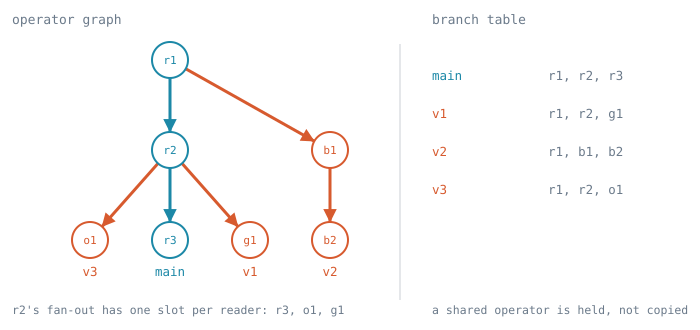
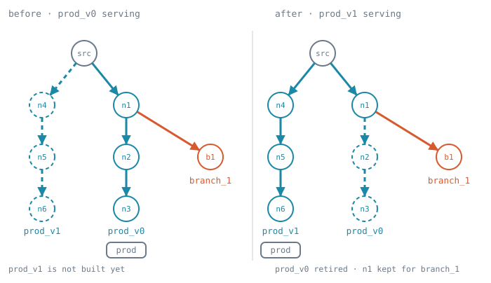

# Program evolution

A running Cambra process holds one or more **branches**, each a named version of a program, recorded
in the **branch table**. Two verbs change what runs. `/branch` creates a branch by copying its
origin's table entry, deletes one, and retargets one onto another origin. `/reload` replaces a
branch's version. A reload keeps every operator whose computation is unchanged along with what it
has accumulated, and seeds every mutable variable the new version still declares with the value it
was holding.

> **Status is per section.** Each `##` heading carries its own marker. [Decided] is built and pinned
> by the tests named in it. [Current] is built and expected to change, so what it describes is the
> code today rather than the design of record. [Prescribed] is a design the code does not have.
> Behaviour under concurrent load is not measured anywhere in this doc.

The operational semantics of a reload, and the three properties that make one well defined, are
[Reload](/docs/operational-semantics/semantics.md#4-reload). This doc is the mechanism that realizes
them. Computing the difference between two programs is [diffing.md](diffing.md). The reload entry
point is `LiveProgram::reload` in `src/live_program.rs`, and the control port is
`src/control_port.rs`, serviced from `src/main.rs`.

Three questions decide a reload:

- **What may change.** Logic, freely. Endpoints, by addition and by removal. State, by addition: a
  version may declare a variable its predecessor does not have, and it starts at its init.
- **What may not.** The continuity of a value that already exists. A variable the predecessor holds
  a value for must be one the new version declares or loads, at a type the value fits, and one the
  source tells apart from its siblings. Otherwise the reload is refused and every branch is left
  serving, per [State takeover](#state-takeover).
- **What survives.** Every `Let` binding, `Transact` store and iteration input whose computation is
  unchanged, and every variable's value whether or not its store was rebuilt.

## Vocabulary

- **Version**: one revision of a program's source, and the operator graph built from it.
- **Branch**: a named version, running from the moment it is created. The branch it was created
  from, or retargeted onto, is its **origin**. The **root** branch, `production`, is the one the
  process starts with and has no origin.
- **Branch table**: the process's map from branch name to that branch's entry: its origin, its
  version, and the operators it holds. An operator is **held** by a branch when the branch's entry
  records it.
- **Divergence**: a site where two versions differ. A node is **divergence-reachable** if a
  divergence is upstream of it in the dataflow graph. A node no divergence reaches is **agreed**,
  and both versions compute it identically.
- **Fork**: the copy a branch takes of its origin's mutable variables at a reload, one per
  divergence-reachable variable, read at one instant of the origin.
- **Stale**: a branch whose origin has reloaded, or which has been retargeted, since the branch was
  created or last reloaded.
- **Orphan**: a branch whose origin has been deleted. It keeps running, and its reload is refused
  until it is retargeted onto a running branch.
- **Mutable variable**: a name a program writes over a domain, whose value a store holds. A store
  carries two things across a reload by two mechanisms. Its variables' values are read off and
  handed over. The iteration position it has folded to travels only by its iteration operator being
  kept.
- **Iteration position**: an index into the sequence a loop reads, absolute rather than a row
  offset. It belongs to the loop that reads it, per [The swap is a runtime
  coordinate](#the-swap-is-a-runtime-coordinate).
- **Commit tick**: a store's private counter over `Txn`. A rebuilt store restarts it at `0`, seeded
  from the value it carried. No two stores' ticks are comparable.

## The control port

> **Status: [Decided]** for `/diff` and `/reload` without a branch segment, which address
> `production`. **[Prescribed]** for every other form.

`--control` (default 8081, `--control=PORT` to change it) serves the verbs below. Dispatch is on the
path alone, so the HTTP method is not checked. A verb that takes a source reads it from the request
body when the body is non-blank, and otherwise from the query string, percent-decoded. Every reply
is `text/plain; charset=utf-8`.

A `<name>` is a non-empty path segment of ASCII letters, digits, `-` and `_`. A `<branch>` segment
that is omitted means `production`.

| Verb | Takes | Does |
| --- | --- | --- |
| `/diff[/<branch>]` | `[phase=<p>&]<source>` | Reports how `<source>` differs from the version `/reload/<branch>` would diff against, at phase `<p>`, and changes nothing |
| `/reload[/<branch>]` | `<source>` | Replaces the branch's version with `<source>` |
| `/branch/<name>[/from/<origin>]` | nothing | Creates branch `<name>` as a copy of `<origin>`'s entry |
| `/branch/<name>/delete` | nothing | Deletes branch `<name>` |
| `/branch/<name>/retarget/<origin>` | nothing | Makes `<origin>` the origin of `<name>` |
| `/branches/list` | nothing | Lists every branch |

Status codes: 200 on success, 400 for a refusal or a compile error, 404 for an unknown path or a
branch name the table does not hold, and 503 or 500 for a request the program dropped or never
answered. A path segment in a `<name>` position that is not a valid `<name>` is an unknown path, so
it answers 404. A refusal's body names what was refused and why. The `/branch` and `/branches` verbs
ignore the request body.

### `/diff`

The phase is one of `lowered`, `inferred`, `inlined`, `channelized`, `as-of-read`, `lambda-elim` or
`planned` (`OFFERED_PHASES`), `as-of-read` by default. The prefix is peeled only when `<p>` is
lowercase letters and `-`; anything else is program text. The reply is the rendered difference
followed by every variable that would begin above its loop's input, per [A variable that begins
above its loop's input](#a-variable-that-begins-above-its-loops-input). `/diff` compiles against the
running endpoint registry and opens nothing, so asking changes nothing any branch serves.

The version compared against is the branch's origin's running version, or for `production` its own,
which is what a reload of that branch diffs against, per [Reloading a branch forks it from its
origin](#reloading-a-branch-forks-it-from-its-origin). A `/diff` naming an orphan is refused, as its
reload would be.

### `/reload`

A 200 reply reads `reloaded: <kept>/<bound> operators kept`, a blank line, the difference at
`as-of-read`, and the variables that begin above their loops' inputs. `<kept>` and `<bound>` are
`ReuseTally`'s counts. A 400 carries the compile errors or the state conflicts. Refused, besides
[State takeover](#state-takeover)'s refusals and compile errors:

- a branch the table does not hold (404);
- an orphan, which has no origin to diff against, until `/branch/<name>/retarget/<origin>` gives it
  one.

### `/branch`

**Create** copies `<origin>`'s entry, `production`'s by default, into a new entry under `<name>`.
Nothing is compiled, built or subscribed, per [A branch is created as a copy of its
origin](#a-branch-is-created-as-a-copy-of-its-origin). Refused when `<name>` is already in the table
or `<origin>` is not. An orphan may be an origin. A 200 reply reads `` created branch `<name>` from
`<origin>` ``.

**Delete** removes `<name>`'s entry, per [Deleting a branch](#deleting-a-branch). Refused for
`production` and for a name the table does not hold. Each branch whose origin was `<name>` becomes
an orphan. A 200 reply reads `` deleted branch `<name>` ``, followed by `; orphaned: ` and the
orphaned branches' names, comma-separated, when there are any.

**Retarget** sets `<name>`'s origin to `<origin>` and marks `<name>` stale, clearing orphan status.
Nothing running changes: the next reload of `<name>` diffs against and forks from `<origin>`.
Refused for `production`, which has no origin; for a name or an origin the table does not hold; and
for an `<origin>` that is `<name>` or descends from it, which would make the chain of origins a
cycle with no root. A 200 reply reads `` retargeted `<name>` onto `<origin>` ``.

### `/branches/list`

One line per branch, `production` first and the rest in creation order, fields separated by a tab:

```
production	-	current	operators=14	shared=9
staging	production	stale	operators=14	shared=9
scratch	qa	orphaned	operators=6	shared=6
```

The fields are the name; the origin, `-` for the root, and for an orphan the deleted origin's name;
the status, one of `current`, `stale` or `orphaned`; `operators=`, the number of distinct fan-outs
the entry's record holds, sink consumers not counted; and `shared=`, how many of those fan-outs some
other entry also holds.

## Scope

In scope: the hot reload built today, and branches that share operators with their origin, reload
independently against it, and are created, listed, deleted and retargeted over the control port.

Out of scope in this draft:

- **Which branch's sinks send.** A reloaded branch builds a sink consumer for every output its
  version declares, so two reloaded branches that both reply on one route both dispatch to it, and
  two branches whose output is their `main` value both print. Sink kinds, compile-time environments,
  and the handling of effects at the program boundary are a separate design.
- **Protected branches.** Any branch but `production` can be deleted by a single request.
- **Rollbacks.** Reverting a reload of a branch (e.g. production) is currently unsupported if it
  drops state (it is bound by normal reload rules).

## The branch table

> **Status: [Prescribed].** The code has one `LiveProgram` and one `OpConversionContext` whose
> `minted` `Inheritance` is the single version's record. The table generalizes that record to one
> per branch.

**A branch's entry is its origin, its version, and the operators it holds.** The version is what a
`LiveProgram` holds today: the `CompiledProgram` (source, tree, outputs) and the main producer. The
operators are what `Inheritance::entries` holds today, a map from a node of the entry's tree to the
`Recorded` operator or store built from it, together with the sink consumers of the entry's outputs.
The recorded `NodeId`s are addresses into the entry's tree, so the entry holds that tree by
reference and a copied entry shares it.

**An operator lives as long as some branch holds it.** An entry holds each `Recorded::Operator` by
its `Rc<FanOut>`, and each fan-out owns the chain under it, per [Nothing inside a fan-out owns
it](#nothing-inside-a-fan-out-owns-it). Dropping an operator from one entry therefore frees it only
when no other entry holds it. A sink consumer needs an explicit `SinkConsumer::detach` to stop
dispatch, so that call is the one place the ownership check is written out: a branch detaches only
the sink consumers no other entry holds.



`production`, `v1` and `v3` share `r1` and `r2`. `v1`'s and `v3`'s reloads diverged below `r2`, so
the fan-out behind `r2` carries a slot for each of `r3`, `g1` and `o1`. `v2`'s reload diverged below
`r1`, so the fan-out behind `r1` carries a slot for `r2` and one for `b1`.

A branch costs the operators only it holds. Creating one costs nothing, and each reload adds the
divergence-reachable subgraph of its version, rounded up to the nearest node that has a fan-out, per
[A split sits at a fan-out](#a-split-sits-at-a-fan-out).

### A branch is created as a copy of its origin

**Creating a branch copies the origin's entry: the same version, the same tree, the same operators
and sink consumers.** The copy clones references and builds nothing, so the new branch runs from
creation and every operator it holds is one its origin already runs. Two branches holding one
operator run it once. Two branches holding one version share its main producer and its sink
consumers too, so that version's outputs are pulled once, not once per branch. Until one of the two
reloads, they compute and send exactly what the origin alone did.

The root is created at process start as `production`, holding the version the process was started
with.

### Reloading a branch forks it from its origin

**A reload of a branch diffs the new version against its origin's running version, not against its
own.** The correspondence is taken against the origin's tree, and the inheritance offered to the new
version is the origin's entry: its recorded operators and the values its mutable variables hold.
Each kept operator is the origin's, and the new version subscribes it through one more fan-out slot,
which is how a reload already places a replacement behind a kept operator, per [2. Keep the operator
at a corresponding node](#2-keep-the-operator-at-a-corresponding-node). The origin's entry is read
and left as it was.

**Each reload is atomic against the origin, and it discards the branch's previous history.** The
branch's divergent variables are forked from the origin's values at one instant, and [State
takeover](#state-takeover) runs against the origin's variables. The operators the branch held before
are not offered, so a variable divergent at the previous reload restarts from the origin's value,
and one agreed at this reload rejoins the origin's store. Reloading a branch with the source it
already runs is therefore a re-fork, not a no-op.

**The branch's entry becomes the operators this compilation recorded**, the origin's kept ones and
the ones it built. Its previous operators are dropped from its entry before the origin's entry is
offered, and freed where no other entry holds them, per [Order of a reload](#order-of-a-reload).

**A reload of the root is the ordinary reload.** `production` has no origin, so its predecessor is
its own running version, as in [The reload lifecycle](#the-reload-lifecycle).

A kept store is shared: it sits in the agreed region, so both branches compute it identically from
the same inputs, and it runs once. A rebuilt store is the branch's own from the fork on. Two
branches' values are never merged: a variable rejoins its origin only by a reload after which it is
agreed, and that reload drops the branch's copy.

**A reload that finds a spent operator in the agreed region rebuilds it under the branch.** The
origin keeps its spent operator. The rebuilt term reads no source, so both compute one value, per [A
binding whose operator is spent is rebuilt, not
changed](#a-binding-whose-operator-is-spent-is-rebuilt-not-changed). A branch's reload never changes
its origin's entry.

### An origin's reload leaves its branches stale

**An origin's reload does not re-diff its branches, and a stale branch stays self-consistent.** The
operators the origin drops that a branch still holds stay alive, because the branch holds them, and
the branch goes on running them. The branch is then stale, and its next reload diffs against the
origin's current version.

**A held operator must be run, not only held.** A held fragment nothing pulls stops releasing, so
the `released_position` of every fan-out it reads stops rising, per [Guards intersect at a
fan-out](#guards-intersect-at-a-fan-out). The origin's next reload would then resume those
iterations below where the origin had reached, and decide positions a second time. A branch's
outputs stay subscribed and pulled for as long as its entry exists. The binary's driver pulls the
`main` output of every version beside `production`'s, and prints a branch's value as `Got value from
<branch>: …`. A version whose `main` has finished is no longer pulled, and the process exits when
`production`'s `main` finishes.



The figure labels the root `prod`. Its entries, before and after the root's reload:

| Branch | Holds before | Holds after |
| --- | --- | --- |
| `production` | `src`, `n1`, `n2`, `n3` | `src`, `n4`, `n5`, `n6` |
| `branch_1` | `src`, `n1`, `b1` | `src`, `n1`, `b1` |

`n2` and `n3` are freed because no entry holds them after the reload. `n1` survives because
`branch_1` holds it, and `branch_1` is stale until its own next reload.

### Deleting a branch

**Deleting a branch removes its entry.** Its outputs are dropped and its sink consumers detached
where no other entry holds them. Its operators are freed where no other entry holds them, and a
freed producer's `Drop` returns its release record to the source it read, per [Retention is the
agreement, and a record dies with its
producer](#retention-is-the-agreement-and-a-record-dies-with-its-producer). Each route no remaining
branch binds is retired, per [Routes across branches](#routes-across-branches).

**Deleting an origin orphans its branches.** Each keeps running what it holds, and keeps its state.
An orphan records its deleted origin's name, and `/branches/list` reports it. A branch created later
under that name is not the orphan's origin: only a retarget gives an orphan an origin. A reload of
an orphan is refused until `/branch/<name>/retarget/<origin>` gives it an origin, and the next
reload then diffs against and forks from that origin.

`production` cannot be deleted, so every chain of origins that no deletion has broken ends at it.

### Routes across branches

**The endpoint registry is the process's, and a route is retired when no branch binds it.**
`SourceSinkRegistry` is shared by every branch, so a version naming a route another branch already
binds binds the same listener and the same source. `retire_routes_absent_from` compares against the
union of the routes every entry's version binds, not against the version just compiled, and
`release_unrouted_ports` drops a port when no branch has a route on it. Deleting a branch runs the
same retirement.

**A branch's new producer starts beside its origin's, not above it.** Under a swap the predecessor's
producer is gone when the replacement registers, so skipping what the agreement covers skips only
what the predecessor finished. A branch's origin keeps running and keeps its producer, so the
agreement includes the origin's unfinished elements, and the branch's new producer is offered them
too. Every branch reading a source reads it through its own producer, and no producer's progress
advances another's view.

**Every branch pins retention for every other.** A source keeps an element until every branch's
producer releases it, so a slow branch holds memory for all of them, until it is reloaded or
deleted. A stale branch also runs what its origin's reloads left it, so each earlier origin version
a branch still runs costs that version's compute and retention.

## How a reload works

> **Status: [Decided]** for `production`. A branch's reload runs the same three steps against its
> origin's tree and entry, [Prescribed].

A reload drops the running version's subscriptions and then builds the replacement's, so one
version's graph is subscribed at a time and nothing observes a half-swapped one. What crosses the
swap is what the teardown does not reach: the process and its listeners, the requests buffered
behind a route, every mutable variable's value, and the operators the handover holds.

Building the replacement is three steps. [Order of a reload](#order-of-a-reload) is the full
sequence, including the guard and the endpoint bookkeeping on either side of them.

### 1. Say which nodes of the two programs correspond

The compile that installs the version diffs its own tree against the predecessor's
(`compile_replacement`, `CompiledProgram::ast`) at `Phase::Planning`, using the structural diff in
`ccl/diff.rs`. The agreed region is what that diff pairs, per [The agreed region is the region a
structural diff pairs](#the-agreed-region-is-the-region-a-structural-diff-pairs).

### 2. Keep the operator at a corresponding node

Conversion consults the correspondence at three places: every `Let` binding
(`OpConversionContext::bind_let`), every store (`OpConversionContext::bind_store`) and every
writer's iteration input (`OpConversionContext::iteration_input`). Each records what it built under
the node it built it from, so the replacement finds the predecessor's operator at its own node's
correspondent and opens a fan-out slot behind it instead of building one. Those are the nodes where
a fan-out sits, per [A split sits at a fan-out](#a-split-sits-at-a-fan-out).

Keeping an operator keeps the whole subgraph under it, including its stores and their accumulated
values. Two conditions bound that: every binding the term reads was kept too ([Reuse is
hereditary](#reuse-is-hereditary)), and a site that needs the operator to supply something finds it
not released in full by its subscribers, since it can then only answer empty ([A binding whose
operator is spent is rebuilt, not
changed](#a-binding-whose-operator-is-spent-is-rebuilt-not-changed)).

### 3. Build the rest and wire it to its input

An operator with no correspondent is built and subscribed like any other. Subscribing is how it
learns where it is: a new subscriber's guard starts at what its input has already released, so it
claims neither data that is gone nor data nobody has finished with. A `FanOut` seeds that guard from
what it has released upstream, and a source seeds a newly registered producer the same way
(`ProducerReleases`, `carry_release_to_new_producers`). This asks one thing of every producer: that
it release what it has finished, and only that.

Nothing establishes a frontier across the graph. Each rebuilt operator resumes wherever its own
input still has work, and two of them can resume at unrelated positions in unrelated inputs.

Two things a subscription cannot supply are computed and handed to the operator being built:

- **The value each mutable variable was holding.** No input holds it, because a store's value at
  position 𝑝 summarizes every position below 𝑝. `live_state` reads it off each store's own cyclic
  fan-out at handover, `Inheritance::mutable_state` carries it, and a rebuilt store seeds from it
  under the variable's `VarPath`.
- **The position a rebuilt recurrence starts at.** It is derived from the input rather than carried,
  but a store and a drive are told it at construction: one past `FanOut::released_position` for an
  iteration the reload kept, `first_position_for_a_new_producer` for one built fresh over a source,
  and `0` for one over a collection.

[Where a rebuilt store picks up](#where-a-rebuilt-store-picks-up) is both of those in full.

## The execution model

> **Status: [Decided]** for the correspondence and the fan-outs a reload keeps operators at.

### The agreed region is the region a structural diff pairs

A node **corresponds** where the two versions' subtrees are isomorphic modulo α. `ccl/diff.rs`
decides it, and `Correspondence` records the `Content::Same` matches and nothing else. A `Same`
node's whole subtree is `Same`, so a kept region's contents are found by walking the tree rather
than by listing them. A node with no correspondent is **rebuilt**, and so is every node above it.

The matcher reads through a renamed binder and a moved subtree, so a reordered or relocated binding
still corresponds. It does not read through an edit: a term that changed at all has no
correspondent.

Correspondence alone is not divergence reachability. `content_hash` matches a term's free variables
by spelling, so an unchanged term can read a binding that changed. [Reuse is
hereditary](#reuse-is-hereditary) closes that gap by transitive closure, and correspondence plus
hereditary reuse is exactly the agreed region.

**Every kept node is agreed, and not every agreed node is kept.** Reuse needs a fan-out at the node,
an `Aligned` binding is always rebuilt, and a spent operator is rebuilt without its term having
changed. A node is therefore rebuilt for one of two causes: it is divergence-reachable, or the
mechanism cannot carry it. Only the first blocks `reads_only_kept`, per [A binding whose operator is
spent is rebuilt, not changed](#a-binding-whose-operator-is-spent-is-rebuilt-not-changed).

### The diff is taken at `Phase::Planning`

A divergence site is a node of the planned tree, after `lambda_elim` and `plan_loops`, with every
loop and transaction carried by a `Transact`. A source-level edit reaches its sites through the
lowering projection, per [provenance.md](provenance.md), not by position in the source.

A node's identity is its address (`NodeId`). The tree the conversion walks must be the tree the
program keeps, which is why `CompiledProgram::ast` is boxed: a bare field is moved into place after
conversion, which relocates the root and leaves the root's recorded operator unreachable.

### A split sits at a fan-out

A fan-out lets one producer feed more than one consumer, and it is the only thing that carries a
producer across a version. It owns the producer it subscribed and re-points the notification to the
new version's slot. A producer's consumer is fixed at `TileOperator::subscribe`, so one lifted out
of a retired graph would go on waking a consumer that no longer exists.

Fan-outs sit at three kinds of node, and those are where a reload keeps operators: where a `Let`
already needs one for sharing, at a `Transact` store, and at a writer's iteration input, where a
rebuild would lose progress a recompute cannot recover. A divergence inside a term is carried by the
nearest enclosing one. Placing a fan-out at every node would change execution characteristics
program-wide.

## Reuse is hereditary

> **Status: [Decided].**

An operator is kept only when every binding its term reads was kept too, so a carried-forward
operator never reads a subgraph the reload rebuilt. `OpConversionContext::rebuilt` records the
bindings this compilation built, and `reads_only_kept` declines any term with a free name among them
(`ccl_utils::free_names`, which counts occurrences inside refinement predicates as well as in the
term). Bindings are bound in dependency order, so the check is transitive: a binding that reads a
rebuilt one is itself recorded as rebuilt.

How much a reload reuses does not depend on how many reloads preceded it. The correspondence relates
this version's tree to the predecessor's tree, and neither depends on how those trees were built, so
an unchanged part of a program is recognized on the first reload
(`reuse_does_not_depend_on_how_many_reloads_came_before`, which compares one edit applied directly
against the same edit applied after a no-op reload).

The same test catches a kept region losing what it holds. Keeping a region does not walk into it, so
nothing inside reaches `bind_let`, `bind_store` or `iteration_input` to be recorded, and the next
version would find nothing at those nodes. `OpConversionContext::keep_region` records it instead by
walking the kept subtree. The region is `Content::Same` throughout, so what it holds is whatever the
previous version recorded at a corresponding node.

### Stores are bindings too

A program's mutable variables live in a `Transact` store bound to `__hist`, and every read of one is
a projection `__hist.k`, where `k` is the variable's spelling. `bind_store` binds the store on the
same terms as any other binding, keyed by the node of its `Transact` term, and keeps a corresponding
one whole. Keeping a store is what carries an accumulator across a reload, because the store is
where the accumulation lives.

One store covers one causal group, so an edit anywhere in a group rebuilds that group's store. Two
independent mutable variables get two stores and are independently reusable
(`an_edit_to_the_accumulating_loop_takes_effect`).

A store below a kept binding is handed on by the `keep_region` walk rather than bound again. Without
the walk, a store declared inside a function body, where the `Transact` sits under the `Let` binding
the call's result, would leave the handover on the first reload that keeps its binding. The next
reload would then reseed its variable from the declared init while the guard, reading the same map,
no longer refused dropping it (`a_variable_survives_a_reload_that_kept_its_binding`,
`the_state_guard_survives_a_reload_that_kept_the_binding`).

### A binding whose operator is spent is rebuilt, not changed

An operator whose subscribers released it in full can only answer empty: it has told its input that
nothing will be read again, and a `Memo` input drops what it holds (`FanOut::released_in_full`). A
binding standing behind one hands its readers nothing
(`a_reload_does_not_seed_an_accumulator_from_a_released_in_full_binding`), so the reload rebuilds it
where the term is recomputable, which makes the rebuilt operator hold what the spent one held.

`bind_let` does not record that rebuild as a change to what the binding computes. `reads_only_kept`
declines to keep an operator reading a binding this version **rebuilt**, because progress through
something the reload replaced means nothing. A binding rebuilt only because its operator was spent
computes what the retired one computed, so a recurrence over it may still take the retired iteration
and continue. Recorded as a change, the recurrence would lose its iteration, restart at `0`, and
fold its whole input on top of the value it carries: the doubling
`a_loop_added_over_a_folded_collection_reads_it_whole` pins.

An iteration input is reused for the position it reached, not for what it supplies, and
`FanOut::released_position` reports that from a spent operator as from a live one. So
`iteration_input` looks the correspondence up through `OpConversionContext::correspondent` and takes
a released-in-full operator. Keeping it says the fold is finished. Building a fresh one would offer
every position of the collection again and fold the whole list onto the carried value
(`a_fold_over_a_fixed_collection_resumes_where_it_stopped`). One released-in-full collection can be
reached from both kinds of site in one reload, so the condition belongs to each site's lookup, not
to the operator.

### What is never reused

A binding compiled under an iteration (`BindingKind::Aligned`) is rebuilt. Its operator is
parameterized by an iteration input threaded into it at conversion time, and the input is not part
of the term, so the term does not identify the operator.

Reuse is all-or-nothing per node. The correspondence records `Content::Same` matches, so a term that
changed at all is rebuilt whole, even where it still computes most of what it did.

## The release model

> **Status: [Current].** What the code does today, for one branch. [Routes across
> branches](#routes-across-branches) says what changes with more.

A subscriber tells its input what it will never read again, and an input keeps a value until every
subscriber has said so. Reuse, resumption and retirement all follow from that rule.

- **Producer**: a subscriber's handle on an input. `TileOperator::subscribe` returns one and fixes
  its consumer, so a producer cannot move to another consumer. A fan-out is what carries one across
  a version instead.
- **Release**: a subscriber telling its input it will never read a region again, as a `Predicate`
  over the input's domain. Releases accumulate by union per producer.
- **Agreement**: the intersection of every registered producer's releases, which is what the input
  may drop (`ProducerReleases::agreed`). The fold's identity is the universal predicate, so the case
  with no registered producer is answered before the fold: it releases nothing.
- **Live view**: `get_elements(producer)` is the retained window minus that producer's own releases.
  Each producer sees its own view of one buffer, so two readers of one source are two producers with
  two views.
- **Drive**: the operator that turns an input's positions into the `(prev…, item)` rows a recurrence
  body decides. `InductionDriver` is `InductionStore`'s cycle partner: store → body → drive → back
  to the store through a cyclic fan-out. The store's decided frontier is the next position to
  iterate, and the drive emits only that position, which makes the cycle well-founded.
- **Decision**: the body's output at one position, either `` `commit `` appending a change or ``
  `abort `` carrying the previous value forward. A decision is looked up by absolute position.

### Retention is the agreement, and a record dies with its producer

`retire_producer` is called from a producer's own `Drop`, so a record lasts exactly as long as the
producer that made it. A record left behind would hold the agreement where a dead producer stopped
for the life of the process. The input would then retain everything above that point, and hand each
replacement a starting point below what its predecessor handled, so the program would answer
requests it answered two versions ago.

An operator carried across a reload keeps its producer and its record, which stops the source
dropping data that operator has not finished with.

### Guards intersect at a fan-out

A fan-out holds one release guard per subscriber slot and intersects them before releasing upstream.
A slot whose producer is gone is skipped, both when notifying and when intersecting, so a departed
subscriber does not pin the intersection where it stopped. A producer addresses its guard by slot
number, so the number lives in a `Cell` the producer and the registry share. `FanOut::reopen` drops
the dead slots and writes each survivor its new number. Without that, the slot list would grow by
one dead entry per replaced subscriber on every reload, and both the notify walk and the
intersection scan it (`reopening_a_fan_out_drops_dead_slots_and_renumbers_the_rest`).

A reload reads two derived facts off a fan-out:

- **`released_in_full`**: every subscriber has released everything, so the operator can only answer
  empty and a `Memo` input drops what it holds. A binding standing behind one hands its readers
  nothing.
- **`released_position`**: the highest position the releases have named, kept beside the guard, and
  only rising. A consumer that finishes an iteration releases the whole domain, and a universal
  guard names no position. Without the watermark a fold that ran to the end of its list would read
  as one that had released nothing, and its replacement would decide every position again
  (`a_fold_over_a_fixed_collection_resumes_where_it_stopped`).

### A drive runs one position behind its decision

A drive holds the input it reads one position back through, so the release runs one position behind
the decision, and a store resuming over a kept iteration starts one past `released_position`.
`InductionDriver` asserts that a decision cannot precede the input it decides.

Two cursors say where a resuming drive is, and neither is recoverable from the window.
`emitted_through` is the item cursor, from which the next position to iterate is taken.
`source_released_through` keeps the drive from re-releasing a prefix its predecessor released. The
store's frontier cannot stand in for either: it counts iterations, and a restricted source's
positions are sparser than its ticks.

### Positions are absolute

Every `DriverRow` carries its own absolute domain position, and released rows compact off the front
without renumbering, because the body looks a decision up by position. A row index is therefore not
a position. A filtered source delivers non-contiguous positions, and on the transaction side a
retried item occupies several attempt positions.

Indexing by row stalls a drive rather than misreading it: the decision lookup finds no row at the
absolute position and the drive stops without advancing. The resumed loop then answers nothing while
the rest of the program keeps serving (`a_store_resumes_however_far_its_source_has_advanced`, which
drives six positions before the reload, because at one or two the two indexings overlap enough to
mask it).

### Where a producer registering now starts

`carry_release_to_new_producers` records the agreement as the starting point for producers
registering from then on, and `first_position_for_a_new_producer`
(`StreamBuffer::first_index_for_a_new_producer`) is that released prefix plus one. Neither has a
default: a source that did not carry would replay its history into the replacement and re-emit an
output for every input the replaced version answered.

The starting point is the agreement, not the newest position, because an index some producer has not
finished with must not be skipped. An element that arrived and went unhandled is still delivered to
whichever version takes over.

## State takeover

> **Status: [Decided]** for `production`. For a branch the predecessor is its origin, [Prescribed].

**A reload is refused unless the new version can receive the state its predecessor holds.** The
predecessor is the branch's origin for a branch and the running version for `production`, per
[Reloading a branch forks it from its origin](#reloading-a-branch-forks-it-from-its-origin). For
each mutable variable the predecessor holds a value for, the new version either **inherits** it or
**loads** it under another name. A variable that does neither has nowhere for its value to go, and
the reload is refused.

**Identity**, meaning which declaration a value belongs to, is checked separately: a value landing
in its neighbour's variable is receivable, so takeover does not catch it. It is the third and fourth
refusals of [Five refusals](#five-refusals).

`LiveProgram::reload` runs both checks before anything is torn down. It compares the variables the
predecessor holds against those the new version declares, read off its planned tree
(`OpConversionContext::state_conflicts`). A refused reload leaves every branch whole and serving.

### Inherit and load

**Inherit** is the default and needs no annotation. A variable the new version declares under the
same identity takes the value it held, whether or not anything names it. Identity is a `VarPath`:
the author-written bindings whose definitions enclose the declaration, outermost first, then the
variable's own spelling, then its index among the variables sharing both.

**Load** is `@LoadFrom(x)`, which decorates a declaration and binds it to the value the predecessor
held for `x`, read once when the replacement takes over ([chl-spec, "8.8
`@LoadFrom`"](../../../docs/chl-spec.md#88-loadfrom)):

```python
# v1
qty: Mut(Int, Txn) := 0

# v2
@LoadFrom(qty)
held <: Map(String, Int)
qty_units: Mut(Map(String, Int), Txn) := [q * 10000 for q in held]
```

`x` is a name the predecessor declared, so the version being compiled need not declare it. Renaming
a variable and retiring one are therefore the same operation with different targets. The load binds
an ordinary binding, and it is a snapshot: the value is what the predecessor held at the instant of
the takeover, constant from then on.

### A load names a specific predecessor

Compiled with no predecessor, a source containing `@LoadFrom(x)` is a compile error naming `x`, so a
version containing one is an upgrade of a specific predecessor. The predecessor today is the
in-process `Inheritance`, which stops such a version being deployed into a fresh environment, a new
region, or CI. A durable store would be a second kind of predecessor, and durable state is
[Sketched](../../../docs/design.md), so which predecessors a load may name is settled there. The
remedy meanwhile is the version with the migration taken out. It retires nothing further, because a
name loaded and not declared is gone after the version that loaded it.

Lowering erases the decorator: the statement becomes a `let` bound to `TypedExprNode::LoadFrom`, a
leaf holding the source's own spelling and resolved at operator conversion. That is `Source`'s
shape, for `Source`'s reason: the name addresses something the compilation is handed, not something
the tree computes. It is not a variable reference, so no scope resolution reaches it and `uniquify`
leaves the spelling alone. The version that retires `x` has no binder for it to refer to.

A loaded value whose extent is a function is built with `Constant::collection`, which tiles it as a
one-level `DataFunction` (`src/interpreter/design-operators.md`, "Tile Operators") rather than as a
bindings table a consumer applies. The value alone does not say which of the two it is, so the site
holding it decides. That is what lets a comprehension iterate a loaded collection, and so what makes
a unit change on persisted state a declaration.

### Which variable a load site addresses

A load site has two names in play. The **loaded spelling** is the `x` of `@LoadFrom(x)`, a variable
of the predecessor. The **target** is the binding the decorated declaration introduces, a variable
of the new version:

```python
@LoadFrom(qty)      # `qty` is the loaded spelling
qty_units: Int      # `qty_units` is the target
```

`state_identities` assigns declarations and load sites their addresses in one walk, so the two
cannot disagree about the binding chain at a point. A declaration's address is the chain enclosing
it (`VarPath`). A site's address is read off the same chain and then resolved outward, the way a
name resolves in the source: the innermost enclosing chain holding a variable of that spelling wins.
Outward means the site's own chain and the chains enclosing it, never a chain below one of those. A
load inside a stateful function's body finds the `` `a`.`total` `` of its own instantiation, and the
same spelling written at the top level reaches nothing. A diagnostic names the spelling alone,
because that is what the source contains.

**The target contributes no chain segment.** A segment comes from descending into a binding's
definition, and a load's definition is the leaf alone, so nothing is declared under the target.
Pushing a segment for it would also move the search's innermost candidate onto a variable no source
can mean: a predecessor's declaration of the loaded spelling inside an instantiation bound to the
target's own spelling.

**A chain declaring the spelling once answers whichever site asks**: one declaration of an enclosing
scope, reached by a site per instantiation. **A chain declaring it more than once is refused.**
Those declarations are the anonymous call sites of one stateful function, told apart by position
alone, and a load carries no position that confirms one. `site_moved` catches a declaration moving
between such positions by the retired site's content, and a load has edited that content at every
site it sits in, so pairing site 𝑖 with declaration 𝑖 would hand each site its neighbour's value on
a reorder. Binding each call site to a name gives the load a chain that resolves, and the refusal
says so.

**Resolution reads what the predecessor declared, not what it holds a value for.** A store the
running program never drove holds no value and is still the variable the name means. Answering from
the values would report such a name as addressing nothing, and refuse the version for dropping a
variable it says where to put. That is why a spelling nothing holds is two refusals below.

### A loaded value summarizes positions

A store's value at position 𝑝 summarizes every position below 𝑝, being their fold. Whether a rebuilt
store resumes above the positions its seed summarizes, or begins at its input, is `continues`, which
each store builder hands to `OpConversionContext::iteration_input`. It is a question about the seed,
not about the variable. An ordinary reload answers it by identity, because a variable carrying its
own value carries its own positions. A load breaks that: the target's identity is new while its
value is one the predecessor folded positions into. So `continues` also reads the nodes the
`@LoadFrom` leaf reaches (`is_a_load`).

The answer is per store, because one store drives one position sequence: a key added beside one that
resumes begins wherever that store resumes, per [A variable that begins above its loop's
input](#a-variable-that-begins-above-its-loops-input).

### Typing a load

Inference gives the `LoadFrom` node a fresh variable, and the declaration's annotation pins it.
Nothing in the source names the predecessor's type: the values arrive at operator conversion, after
inference, and a runtime `Value` carries no CCL type. What the predecessor holds is checked against
what inference concluded, by the same comparison a declaration gets. A record annotated at one of
its two fields is refused (`StateConflict::LoadFromAt`), not narrowed, because a value read at
another shape becomes a constant of the wrong extent and the operator built around it fails on its
first pull.

### Five refusals

- **A variable the new version neither declares nor loads.** Its value has nowhere to be seeded.
- **A variable it declares, or loads, at a different type.** Its value cannot seed a store built for
  another shape. Allowed through, the store is constructed around a constant of the wrong extent,
  and the process dies on the next pull (`Scalar(Strings([…])) vs Scalar(Int)`) and takes every
  endpoint with it.
- **A value that would move between two declarations the source does not distinguish.** Two
  anonymous call sites of one stateful function are told apart by position alone, so reordering
  them, or inserting a third ahead, hands each variable its neighbour's value. The site's own
  content catches it: a site whose body the reload edited is gone from the new version, and one
  still present under a different variable has moved (`site_moved`). The refusal names both
  declarations and says that binding each call site to a name makes the edit carry
  (`swapping_two_anonymous_call_sites_is_refused`).
- **A `@LoadFrom(x)` where the predecessor declares `x` more than once under one chain.** This is
  the same move with the load's own edit in the way, per [Which variable a load site
  addresses](#which-variable-a-load-site-addresses).
- **A `@LoadFrom(x)` naming a variable nothing holds.** Either no variable of that spelling is in
  scope at that point in the predecessor, or one is and the predecessor has decided no value for it:
  a store nothing reads is never driven, so it declares its variables and hands on nothing. The two
  are reported separately, because in the second case the source is right about where the value goes
  and only the value is missing.

Nothing else is refused. A lost value is refused because the program carries on answering afterwards
with only the accumulated history gone, so the author has nothing to notice. One other outcome is
silent in the same way, and it is reported instead of refused, off the same tree at the same moment:
a loop that begins above the beginning of what it reads, per [A variable that begins above its
loop's input](#a-variable-that-begins-above-its-loops-input). Everything else either works or fails
visibly.

## Where a rebuilt store picks up

> **Status: [Decided].**

**A rebuilt store resumes each carried variable from the value its predecessor held, not from the
declared init.** Editing a loop changes what it does next without discarding what it accumulated:
editing how a guestbook formats an entry leaves the recorded entries as they were and formats the
next one the new way. A variable carrying nothing starts at its declared init, per [A variable that
begins above its loop's input](#a-variable-that-begins-above-its-loops-input).

Three things decide where a store picks up, and two of them are handed over:

**The value** is handed over. A store's value rides its own cyclic `FanOut` as a `Tile::Store`, so
`live_state` reads each carried key off `FanOut::cached_tile` with `store_frontier` and
`store_value_at`, `Inheritance::mutable_state` carries it, and the rebuilt store seeds from it under
the variable's `VarPath`. Reading the fan's own memo, rather than a copy kept beside the operator,
keeps this off the shared-state ledger `./ci.sh shared_state` maintains: no value crosses between
operators outside a tile.

**The name** addresses the value. State is keyed by `VarPath`, so a stateful loop added anywhere
shifts nothing: `` `a`.`n` `` is `` `a`.`n` `` however many other `n`s the version declares
(`a_loop_added_ahead_of_a_same_spelled_one_starts_at_its_init`,
`reordering_two_same_spelled_variables_keeps_their_state_apart`). The spelling carries the meaning,
because a writer's write set is keyed by the variable written, and the chain tells two declarations
of one spelling apart. The index is used only for the shape the source names nothing in: two
anonymous call sites of one stateful function in one expression. A reorder that edits both bodies at
once leaves neither site present to recognise, so the position decides and the values cross.

A spelling is not unique, and nothing computed can stand in for one. A declaration can be shadowed,
and a function holding a stateful loop declares one variable per call site once inlining has cloned
its body. Two instantiations can then differ only in their writer bodies after substitution, so a
content-derived identity either fails to tell them apart or changes under the edit state has to
survive. The enclosing bindings are what is left, and one walk (`state_identities`) assigns identity
for both the guard and conversion to read.

**The position** travels with the kept iteration operator and is not carried. A rebuilt store
resumes one position past what its iteration operator has released (`FanOut::released_position`),
which is where the retired recurrence had reached, per [A drive runs one position behind its
decision](#a-drive-runs-one-position-behind-its-decision). The store's seed tick
(`CommitEngine::seeded_at`) and the drive's cursors both come from that one number. A variable whose
new version reads a different iteration seeds its value and takes that iteration's position. That is
a variable moving between loops, or a program moving to another port: the positions it is about to
decide belong to something its predecessor never read, so none is decided twice and none is skipped,
while the value goes on.

**Starting again is not starting at `0`.** A loop's iteration built fresh over a source starts at
`first_position_for_a_new_producer`: `0` for a source nothing has read, and the released frontier
otherwise, because another loop may have been reading and releasing it all along. Basing a drive
below that makes it wait for an element that is not coming, which is a silent stall rather than a
wrong answer. A store the version adds is subject to the same rule
(`a_stateless_loop_may_gain_an_accumulator_over_an_advanced_source`).

A fold over a collection that carries a value resumes over the kept iteration at the position it
reached, so an edit inside the loop governs the remaining elements, and a fold over another
collection is a different node, which rebuilds the iteration and starts that collection from its
first element. The resumed store seeds tick `0` with the value handed over, so a reader enumerating
the whole collection reads that value for the positions the predecessor decided. A fold caught
partway keeps what the retired version decided below the swap, and the new version decides the rest
(`a_fold_interrupted_partway_resumes_at_the_position_it_reached`).

A transaction's drive counts in its writer's iteration input and takes a kept one's position
(`a_transaction_over_a_fixed_collection_does_not_replay`). Over a rebuilt iteration it starts at `0`
whatever its source has done, because it finds its next item by scanning up from its cursor: an
advanced source costs it a comparison where an induction drive's window would stall
(`a_stateless_route_may_gain_a_transactional_writer_over_an_advanced_source`). A store with more
than one writer needs nothing extra, because each site's iteration is its own node and each drive
reads its own input's position.

A rebuilt drive is handed elements its predecessor already decided. The release state a source hands
a newly registered producer runs below the store's resume position rather than deciding it, because
a drive holds the input it reads one position back through, so the drive holds those elements
without re-deciding them.

### A variable that begins above its loop's input

A recurrence starts at a position and folds upward from it, so which position it starts at and what
its input can offer are one question. The answer is per store: one loop drives one position
sequence, and a store's variables share it.

A variable **carrying a value**, inherited or loaded, has had every position that value summarizes
folded into it. Its loop takes the retired iteration and starts one above what that iteration
released, so no element is folded twice. That is property 1 of
[Reload](/docs/operational-semantics/semantics.md#4-reload).

A variable **carrying nothing** starts at its declared value, which summarizes no position, so it
wants its loop's input from the beginning. It gets that only where the loop's input is rebuilt,
which happens where nothing in the store carries and the input's term can be built again: a fresh
iteration over a collection of literals starts at `0` and folds it whole. Otherwise the loop is the
retired one continued, and the variable begins wherever that loop resumes. That includes a variable
added to a loop whose other variables carry.

A source and a collection are one case. A source offers a new producer what its retired producers
had not released, and a kept operator holds what its retired consumers had not released: one
condition, read off two mechanisms. A term can be built again exactly when it reads no source, which
`OpConversionContext::recomputable` answers.

`unreadable_inputs` reports every variable that begins above its loop's input, in the reload's
report and in `/diff` before that. It reports instead of refusing, because the elements are gone and
folding from here is all that is left. The source does not say which was meant: an accumulator added
to a live endpoint intends a running total from here, a view over a retained feed intends the whole,
and the two are the same term. The declaration is where that belongs, and until it can say so the
report makes the choice visible.

The cases: `a_loop_may_gain_an_accumulator` (the added variable begins where its loop is, though the
loop's other variables carry),
`a_stateless_route_may_gain_a_transactional_writer_over_an_advanced_source` (a commit drive starts
at `0` and scans up, so its source decides where it begins),
`a_loop_that_cannot_read_its_collection_from_the_start_is_reported` (nothing in the store carries
and the input reads a source), and `a_loop_added_over_a_buildable_collection_reports_nothing` with
`a_loop_added_over_a_folded_collection_reads_it_whole` for the case that is rebuilt.

## The reload lifecycle

> **Status: [Decided]** for `production`. A branch's reload follows the same order against its
> origin, [Prescribed].

A reload is a **swap**: the reloaded branch's subscriptions are dropped and the replacement's are
built, so one version of that branch is subscribed at a time and nothing observes a half-swapped
one.

### Order of a reload

1. Render the difference between the predecessor's source and the new one, which compiles both to
   `Phase::AsOfRead`.
2. Compile the new version to `Phase::Planning` against the endpoint registry, binding any port it
   adds, and run the state-takeover guard on the planned tree. Neither step builds an operator, so a
   version that fails either leaves every branch serving, and a refusal hands the ports back
   (`release_unrouted_ports`). The report of every variable that begins above its loop's input comes
   off this tree and is carried in `ReloadReport`, not rendered into the difference.
3. Tear down the branch's graph: detach its sink consumers and drop its outputs. For a branch
   sharing its entry, only the sink consumers no other entry holds are detached, per [The branch
   table](#the-branch-table).
4. Offer the predecessor's operators and stores as the next compilation's inheritance. For
   `production`, `GlobalContext::retire_version` records each source's agreement for producers
   registering from then on (`carry_release_to_new_producers`) and moves the retiring conversion
   context's record into the inheritance. For any other branch, the branch's previous record is
   dropped first, freeing what no other entry holds, and the origin's entry is then offered by
   reference and stays the origin's.
5. Compile and subscribe the new version against the same registry, which binds every endpoint a
   running version left open and opens the ones it adds. This compile diffs its own tree against the
   predecessor's (`compile_replacement`) to get the correspondence reuse is keyed on. The branch's
   entry becomes what it recorded.
6. Notify each of the branch's sinks, so whatever is already available is pulled.

Where each part of a program stands after a swap:

| Part of the program | Where it starts | Mechanism |
| --- | --- | --- |
| An operator the new version also has | Where it already was; nothing is replaced | Node correspondence, one more `FanOut` slot |
| A rebuilt map or feed over a kept operator | What that operator has released | A new subscriber's guard starts there |
| A rebuilt map or feed over a source | What the source's retired producers released | `carry_release_to_new_producers` |
| A rebuilt recurrence over a kept iteration | One past what that iteration's readers released | `FanOut::released_position` |
| A rebuilt recurrence over a rebuilt iteration | Where that iteration begins: a source's carried release, or `0` for a collection | `first_position_for_a_new_producer` |
| A transaction writer's drive | Its writer's iteration input where the reload kept it, and `0` over a rebuilt one | Absolute item positions, released on the commit-ack |
| A rebuilt store's commit tick | `0`, seeded from the carried value | Private and restartable |
| A route, its listener, and the requests behind it | Where they were, while any version still binds a route on the port | `SourceSinkRegistry` |

Step 1 opens nothing. Rendering a difference runs with `Endpoints::Inherited`, so a route the
registry does not hold is named rather than opened: the context is thrown away but a socket is not,
and opening one would make asking a question change what the program serves.

Step 2 opens ports, because binding is the one thing it and step 5 would otherwise not share. A port
already in use (a typo, the program's own control port, a port another process holds) would
otherwise fail first at step 5, after step 3 had torn the running graph down, as the panic step 5
documents. Taking the port at step 2 makes it an ordinary compile error raised while the program is
whole, and taking it rather than probing means nothing can claim the port in between
(`a_version_naming_an_unbindable_port_is_refused`).

Steps 3 and 4 come after step 2, so a rejection is never destructive, and before step 5, so what the
new version inherits is held by the inheritance and not also by a running graph of the same branch.

A branch's previous record is dropped before the offer because the offer is where each source
records its agreement. Left registered, the branch's own retired source producers would count in
that agreement, so a producer the new version registers would start at their position. A store
rebuilt from the origin's value, which already summarizes those elements, would then fold them a
second time. The root's own record is the offer, so it cannot be dropped first.

Step 6 is needed because an operator notifies from inside `subscribe` (an induction store does, to
start its loop), and a sink consumer's producer does not exist until `subscribe` returns. Those
notifications reach a consumer with nothing to pull and are dropped. A first compile is covered
because a source holding data reports it as new on the next poll. A replacement is not, because the
version it replaces already took that report, so without step 6 a reload installed while work is
outstanding (a fold caught partway, a request accepted and not yet answered) sits until the next
arrival (`a_version_installed_mid_fold_is_pulled_without_a_new_arrival`).

An accepted reload compiles four times: twice for the diff, once to `Planning` for the guard and the
report, and once for real. `run_frontend` goes from source to a stop phase and cannot continue a
stopped tree into operator conversion, so the guard's tree is not the one that gets built, and
`LiveProgram::reload` documents a panic for the two compiles disagreeing. `/diff` compiles three
times: the same two, and a `Planning` tree of its own for the report. Reuse is keyed on step 5's
tree, because a node's identity is its address and a correspondence taken against step 1's or step
2's tree would name nodes the built graph was not built from.

> **Open: the swap pauses the process.** Steps 3 to 5 run between two pulls with `&mut self`, and a
> rebuilt store folds what its input offers before the new version answers anything. A `@LoadFrom`
> whose initializer is a comprehension over a large map computes that migration inside the swap. The
> endpoints stay bound, so nothing is lost, but nothing is served until the largest migration
> finishes. With branches, a branch's reload pauses every branch in the process.

### The swap is a runtime coordinate

The swap has a place in execution order and no place in any domain the program has.

**It is totally ordered against everything.** The driver services the control port between two
pulls, `LiveProgram::reload` takes `&mut self`, and one version of a branch is subscribed at a time,
so every operator in the process has an unambiguous before and after.

**It is not a position.** Positions are indexed by the reading loop
([mutability.md](mutability.md)), each store has a private commit tick, and a rebuilt store restarts
at `0` seeded from the carried value. At the instant of a swap one source can be at 8,000, another
at 7, and each store at its own tick, and no number names the swap in a way any two of them agree
on.

So **a swap is atomic in subscription and non-atomic in position**. No operator observes a
half-swapped graph, and the positions the new version resumes at are per operator and unrelated.
That keeps independent loops independent: a transaction's drive over a rebuilt iteration starts at
`0` while another loop continues at 8,000
(`a_stateless_route_may_gain_a_transactional_writer_over_an_advanced_source`). It also needs no
barrier, where a program-wide clock would need a quiesce that makes a fast loop wait for a slow one.

What it costs:

- **No state as of a position.** Reloading the previous version reinstalls it; nothing restores
  state as of position 𝑝.
- **No program-wide as-of.** What the program held at the swap can be asked per store, not across
  stores, because there is no consistent cut to query.
- **Answer order and arrival order come apart.** A request buffered before a swap is answered after
  it by the new version (`a_request_that_arrived_before_the_swap_is_answered_after_it`). Each
  request is answered by exactly one version of a branch, and arrival order does not say which.

## Sources and sinks outlive a version

> **Status: [Decided]** for `production`. [Routes across branches](#routes-across-branches) says
> what changes with more.

A `SourceSinkRegistry` (`ccl/context.rs`) holds a program's open data sources, the reply sink of
each open `http_serve` route, and the listener behind each bound port. A listener's socket, its
routing-table entry, and the requests buffered behind it are program state, not compilation state,
and they outlive the version that opened them.

Compiling any version seeds a fresh `LoweringContext` from that registry. An `http_serve` call
naming a route the registry holds binds it, keeping the listener and everything buffered behind it,
and one naming a route it does not hold opens it. Adding an `http_serve` therefore works: the added
route serves as soon as the swap completes, and what was already there keeps its state. Routes are
keyed by their source name, not by the response binding's name, which a new version may spell
differently. Seeding the registry is also what lets `/diff` be answered about a running program:
compiling the new version in a fresh `GlobalContext` would try to bind a port the running program
holds and fail.

### A route a version stops serving is retired

Removing an `http_serve` is accepted, and the route goes with it. Left registered, the address would
keep matching requests and buffering them for a reader that no longer exists, and the client would
wait on a reply nobody computes. `SourceSinkRegistry::retire_routes_absent_from` compares the routes
the pass bound against those the registry holds and unregisters the difference, so the address
answers 404.

A request that arrived before the unregister has no version left to answer it, and retirement
answers it with the same 404. The source holding such a request outlives the route, because a
retired version's operators sit in the next compilation's inheritance and reach the source through
it, so nothing else ends the client's wait. `DataSourceDomainExtentImpl::answer_in_flight` drains
both stages a request waits at: the dispatcher's channel, before the source has accepted it, and the
shared pending map, after. The stage a request reached therefore does not decide what its client
sees (`a_request_that_arrived_before_its_route_was_retired_is_answered`).

Retiring belongs to installing a version, not to compiling one, so it runs in `compile_program`
rather than in `run_frontend`. A diff compiles the new version against the running registry, so a
compile that unregistered a route would make `/diff` change what the program serves
(`diffing_against_a_version_that_drops_a_route_does_not_retire_it`).

The port goes when its last route does. While a sibling route survives there the listener stays, so
the retired address answers 404 rather than refusing a connection. Once nothing is registered,
`release_unrouted_ports` drops the listener and the socket closes, so a version that moves its
endpoints to another port releases the one it left. `SharedHttpServer` holds the listener beside the
dispatcher thread and unblocks the thread on drop, so the thread's own shutdown path runs and its
`Server` goes with it (`a_port_whose_last_route_goes_is_released`).

### A subscription lasts as long as its producer

Replacing a graph while sharing operators with it requires knowing which subscriptions are still
live. Three registrations answer that the same way: the subscriber owns its side, and the registry
holds a weak reference.

- **Fan-out slots.** `FanOutShared::subscribers` holds a weak reference per slot, and the strong
  side lives in the `FanOutProducer` that slot handed out. A dead slot is skipped and renumbered per
  [Guards intersect at a fan-out](#guards-intersect-at-a-fan-out).
- **Scheduler wake-ups.** `Scheduler::add_source_handle` records a `Weak<RefCell<dyn Consumer>>`,
  and the `IterateExtentProducer` that registered it owns the strong side. A source handle outlives
  a version and the subscriptions against it do not. A strong registration would keep every operator
  any version ever subscribed alive and notified.
- **Sink dispatch.** `SinkConsumer::detach` clears the producer slot at teardown. An operator the
  next version carries forward still holds the notification closure that reaches the old sink
  consumers, so without the clear they would keep being woken and keep writing to sinks the new
  version now feeds. Clearing the slot also drops the operators behind it, which lets the fan-outs
  they subscribed to see those subscriptions end.

### Nothing inside a fan-out owns it

A fan-out owns its input chain through `FanOutShared::producer`, so a handle on the fan-out held
from inside that chain closes a cycle and nothing in the subgraph is freed. `FanHold` names the
distinction that avoids it: a downstream reader owns the fan-out, and a reader inside its input
chain does not. Two readers sit inside:

- **The notification closure.** `FanOutBranch::subscribe` hands the input a closure that wakes the
  fan-out's consumers. The closure holds a weak reference and does nothing when it cannot upgrade,
  which is when the fan-out is gone and has no consumers left to wake.
- **A store's recurrence.** A store's driver reads the store to recover each position's prior value,
  and a transaction's writer reads it to decide a commit. Both hold the store by
  `FanOut::recurrence_branch`, and both read only while the fan-out is pulling the chain they sit
  in, so the fan-out is alive for the whole read.

This frees a retired version's operators, and the release bookkeeping depends on it: a source hands
back a producer's release record from that producer's `Drop`, so a producer that outlives its
version goes on constraining the agreement from where it stopped, and the next version is offered
what the retired one already committed (`a_second_reload_does_not_replay_what_the_first_committed`).
The branch table relies on the same property: an operator no entry holds is freed, per [The branch
table](#the-branch-table).

## What a reload does not do

> **Status: [Decided]** as a scope decision.

- **Start a carried variable from its declared init.** It resumes from the value, per [Where a
  rebuilt store picks up](#where-a-rebuilt-store-picks-up).
- **Reuse across a change of shape.** Reuse is all-or-nothing per node.
- **Reuse at every node.** Reuse needs a fan-out at the node, and one sits at three kinds of node,
  per [A split sits at a fan-out](#a-split-sits-at-a-fan-out).
- **Run two versions of one branch.** The replaced version of the reloaded branch is dropped, except
  for the operators another branch holds.
- **Merge two branches' histories.** A variable rejoins its origin only by a reload after which it
  is agreed, and that reload drops the branch's copy.
- **Promote a branch.** A branch's state never becomes its origin's. The operations are the verbs of
  [The control port](#the-control-port).
- **Restore state as of a position.** Iteration positions belong to loops and commit ticks to
  stores, and no program-wide instant exists to restore to.

## What the guard lets through

> **Status: [Decided].**

The guard accepts every edit that leaves the state takeable:

| Change | Outcome |
| --- | --- |
| Logic of a loop or a transaction writer | Accepted; the variable resumes |
| A loop gains an accumulator under a new name | Accepted and reported; the others resume, and the new one starts at its init and folds from where the loop has got to, since one loop drives one position sequence |
| A variable's declared init changes, type unchanged | Accepted; the carried value wins, and the init is only for a fresh start |
| A whole stateful loop is added under new names | Accepted; existing state is untouched. It folds its input whole where this version can build that input again, and from where that input starts where it cannot, which is reported |
| A route serving statelessly gains a transactional writer | Accepted and reported; the writer commits from the next request, replaying none the route already answered |
| A route is added | Accepted; it serves as soon as the swap completes |
| A route is removed | Accepted; the route is retired and answers 404 |
| A variable is renamed, with `@LoadFrom` naming the old spelling | Accepted; the target starts at the value the old name held |
| A loop loses an accumulator that no `@LoadFrom` names | Refused, naming it |
| A variable's type changes, records included | Refused, naming both types |
| A variable is added whose name another already has | Accepted; the bindings enclosing each declaration tell them apart, so the existing one resumes and the added one starts at its init |
| Two anonymous call sites of one stateful function are reordered, or a third is inserted ahead | Refused, naming both declarations and saying to bind each call site to a name |
| The same, with both bodies edited in the one reload | Their state crosses. Neither site is left for `site_moved` to recognise, so the position decides: the one shape the identity does not address |
| A variable moves to another loop | Accepted; it seeds with the value it held and decides the positions its new loop's iteration still has |
| A variable moves to or from a transaction | Accepted in both directions; the value carries and the position comes from whatever the variable now iterates. A commit tick hands on no position, and over an unchanged collection both sides read the same kept iteration, so a fold caught partway resumes where it stopped rather than committing an element twice |
| A loop reads another source, such as a port change | Accepted; as above, and the port it left is released |
| Two loops, or two transaction writers, swap which source they read | Accepted; each keeps its value and continues on the source it moved to, taking over that source's iteration |
| A variable moves to a loop over a fixed collection | Accepted; the value seeds and the collection folds on top of it |
| The body of a loop over a fixed collection is edited | Accepted; the fold resumes at the position it had reached, so the new rule governs the elements left |
| The collection itself is edited | Accepted; the edited collection is a different computation, so its iteration is rebuilt and the collection folded whole |

A request a surviving route delivers is therefore answered by exactly one version, and a request
buffered before the swap is answered after it: the buffer belongs to the source rather than to
either graph (`a_request_that_arrived_before_the_swap_is_answered_after_it`). A route the reload
retires is where that runs out: the source behind it is unreachable from the new graph, so
retirement answers those requests itself, per [A route a version stops serving is
retired](#a-route-a-version-stops-serving-is-retired).

A program whose output is its `main` value rather than a sink reloads the same way. `stdin` is
unbounded, so the binary's driver loop keeps running and services the control port between pulls.
The guard names such a program's loops by the address the source gives them: a bare `` `n` `` where
the program declares one, and `` `a`.`n` `` where the declaration sits inside a binding (`VarPath`'s
`Display`). Its state reads the same way as a sink program's:

- A pure element-wise transformation splits exactly at the swap. Eight lines with the swap after the
  fourth emit four under the old rule and four under the new, each once: the stream is neither
  replayed through the new version nor dropped at the handover.
- An accumulator carries across. Counting `+1` per line, switched to `+2` after half the stream,
  gives `1.5` times the line count at EOF, each half counted by the rule in force when it arrived.
- Feeding the accumulator out (`out << n`) reports it per line, so the swap is visible mid-stream:
  `1, 2, 4, 6` resumes from `2` rather than restarting.

A bare trailing `n` reports the value at the position it is read, and at the tail of the program
that position is EOF. That is a property of that program, not a limit on what a reload carries.

